# Prim's Algorithm: a step-by-step walkthrough

[](https://github.com/MarynaShavlak/algo-prim)

[🇺🇦 Українська](README.md)  ·  **🇬🇧 English**

**Prim's algorithm** builds a **minimum spanning tree** (MST) of a connected undirected weighted graph: out of all the edges it picks a set that connects **every** vertex **without cycles** and has the **smallest total weight**.

It is a classic example of a **greedy algorithm**: the tree grows from a single vertex, and at every step the **cheapest** edge leading outside joins the tree. Here the locally best choice provably adds up to the globally optimal answer — and below we will see why (the cut property).

The repository is educational material: a clean implementation of the algorithm + detailed visualizations of every step. The entire walkthrough below is reproduced by the code in [`examples/`](examples), and the figures live in [`docs/images/en/`](docs/images/en).

> **About the graph.** The main example is **the very same graph `A–F`** as in the neighbouring walkthrough of the [Floyd–Warshall algorithm](https://github.com/MarynaShavlak/algo-floyd-warshall): the same six edges with the same weights and even the same vertex coordinates in the figures. There is one difference: there the graph was **directed** (shortest paths depend on direction), while an MST is defined for **undirected** graphs — so the arrows are gone and every edge can now be traversed both ways.

---

## Contents

- [Repository structure](#repo-structure)
- [Quick start](#quickstart)
- **Theory**
  - [Intuition: a cable network](#intuition)
  - [Prim's idea: a growing tree](#idea)
  - [Why the greedy choice is safe: the cut property](#cut)
  - [The priority queue and lazy deletion](#lazy)
- **Example 1 — graph `A–F` (the same one as in Floyd–Warshall)**
  - [The example graph](#graph)
  - [The basic implementation](#code)
  - [Step 0. Initialization](#init)
  - [Steps 1–5. The tree grows](#walkthrough)
  - [The big picture: evolution of the tree](#evolution)
  - [Result: the MST and the rejected edge](#result)
- **Example 2 — the lecture graph `A–G`**
  - [Lazy deletion in action: three stale edges in a row](#lazy-example)
- **Limitations**
  - [A disconnected graph: why Prim blows up and what to do](#disconnected)
- [Step-by-step code execution: code ↔ graph ↔ queue panels](#code-walkthrough)
- **Wrap-up**
  - [Complexity and comparison](#complexity)
  - [Where it is used](#applications)
  - [Bonus: the eager version (a duplicate-free queue)](#eager)
  - [Summary](#summary)
- [License](#license)

---

<a id="repo-structure"></a>

## Repository structure

The directory tree and the responsibilities of each module live in a separate file — **[PROJECT_STRUCTURE.en.md](PROJECT_STRUCTURE.en.md)**.

---

<a id="quickstart"></a>

## Quick start

Commands for installation, running the examples and the tests, plus a minimal library-usage example — in **[USAGE.en.md](USAGE.en.md)**.

---

<a id="intuition"></a>

## Intuition: a cable network

Picture the vertices as **cities** and the edges as **possible cable routes** with a cost to lay each one. The task: every city must be connected to every other (transit through other cities is fine), and the total cost of the laid cable must be **as small as possible**.

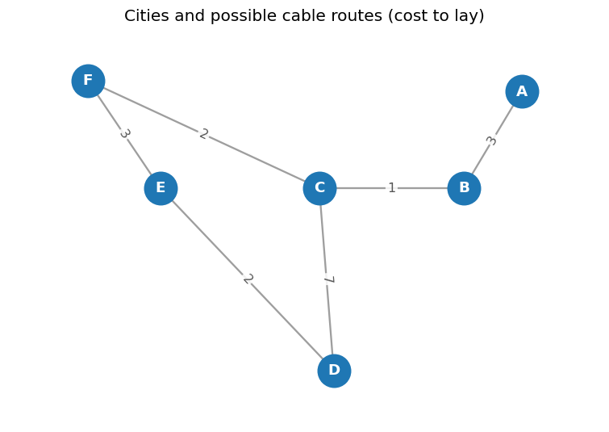

Two observations immediately simplify the problem:

1. **Cycles are wasted money.** If the laid cables form a cycle, any cable of that cycle can be removed — connectivity survives and the cost drops. Hence the optimal plan is a **tree**.
2. **A tree on $n$ cities has exactly $n-1$ cables.** Fewer — someone is cut off; more — there is a cycle.

What remains is to pick the **cheapest** of all possible trees — and that is precisely the minimum spanning tree:

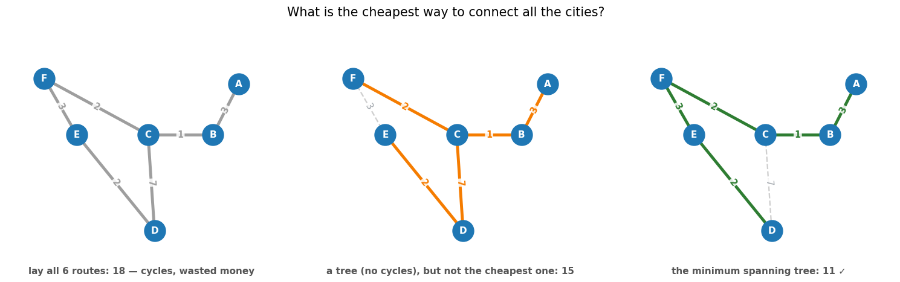

▶️ The same in motion — three plans one after another (all routes for 18 → a tree for 15 → the MST for 11):

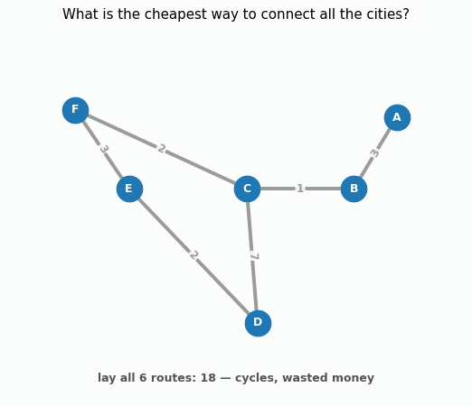

🎬 *MP4 version:* [`cable_plans_abcdef.mp4`](docs/images/en/cable_plans_abcdef.mp4)

Note: the MST minimizes the **total cost of the network**, not the distances between pairs of cities. Pairwise shortest paths are the job of Floyd–Warshall or Dijkstra; the question here is different: *what is the cheapest infrastructure that connects everyone*.

<a id="idea"></a>

## Prim's idea: a growing tree

Prim builds the MST the way a crystal grows in a solution:

1. **Start** — any single vertex (a tree of one "city").
2. At every step, look at **all edges connecting the tree to outside vertices** and take the **cheapest** one.
3. The edge and its new vertex join the tree. Repeat until every vertex is in the tree — exactly $n-1$ accepted edges.

The tree **always stays in one connected piece** — it simply "grows over" new vertices (compare with Kruskal, which keeps a forest of many pieces and stitches them together).

An edge leading from the tree into the tree is never considered: it would close a cycle, and we have no use for cycles.

<a id="cut"></a>

## Why the greedy choice is safe: the cut property

Greedy algorithms often produce suboptimal answers, so "take the cheapest and all will be well" needs a proof. For MSTs the proof is the **cut property**.

A **cut** is a split of all vertices into two non-empty parts. We care about the cut "tree $S$ vs. the remaining vertices $V \setminus S$":

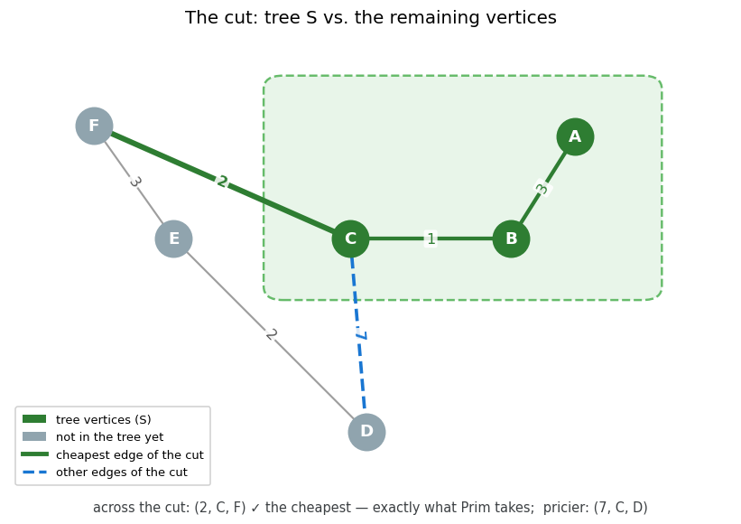

> **Cut property.** Let $S$ be any set of vertices and $e$ the **cheapest** edge crossing the cut (one endpoint in $S$, the other outside). Then there exists a minimum spanning tree containing $e$. *(If all weights are distinct, $e$ lies in **every** MST.)*

**Proof by exchange (idea).** Take any spanning tree $T$ that does *not* contain $e = (u, v)$. In $T$ there is a path between $u$ and $v$, and at least one of its edges $f$ also crosses the cut (the path must "jump" out of $S$ at some point). Swap $f$ for $e$: connectivity survives, no cycle appears, and the weight does not grow, because $w(e) \le w(f)$ — after all, $e$ is the cheapest across the cut. Hence $T$ without $e$ is never *strictly better*.

Prim does exactly this at every step: its cut is "the tree built so far vs. the rest", and it adds the cheapest edge across that cut. Every step is safe → the resulting tree is minimal.

▶️ The cut property in motion on our graph — before each step you can see all the edges across the cut (blue dashed) and the cheapest one (green), which is what the algorithm takes:

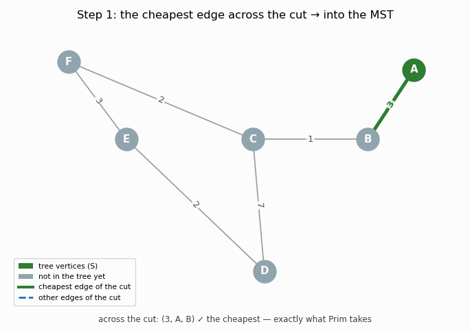

🎬 *MP4 version:* [`cut_steps_abcdef.mp4`](docs/images/en/cut_steps_abcdef.mp4)

<a id="lazy"></a>

## The priority queue and lazy deletion

Taking "the cheapest edge across the cut" naively means scanning all edges at every step: $O(E)$ work $n$ times. Faster: keep the candidate edges in a **priority queue** (a binary heap, module `heapq`):

- when vertex $v$ joins the tree, **all** edges from $v$ to not-yet-visited vertices go into the queue (`heappush`);
- the queue hands out the edge with the **smallest weight** in $O(\log E)$ (`heappop`).

A queue element is the tuple **`(weight, from, to)`**. Python compares tuples lexicographically: weight first, then the vertex names on ties. So the pop order is fully deterministic and ties are broken alphabetically.

**The subtlety:** a queue cannot "forget" an edge that nobody needs anymore. While the edge $(w, u, v)$ was waiting its turn, vertex $v$ may have joined the tree **via another, cheaper edge**. Such an edge is called **stale**. Prim handles this with **lazy deletion**: do not search for or delete anything ahead of time — just check after popping:

```python
if v not in visited:   # vertex still outside? → accept the edge
    ...
# otherwise the edge is stale — silently skip it
```

This very line is the heart of the basic implementation. In Example 1 no stale edges will appear (the graph is small), but in [Example 2](#lazy-example) the algorithm will skip **three** stale edges in a row.

---

<a id="example-1"></a>

## Example 1 — graph `A–F` (the same one as in Floyd–Warshall)

<a id="graph"></a>

### The example graph

We work with an **undirected weighted** graph: 6 vertices, 6 edges.

| edge | A–B | B–C | C–D | C–F | D–E | E–F |
|---|---|---|---|---|---|---|
| **weight** | 3 | 1 | 7 | 2 | 2 | 3 |

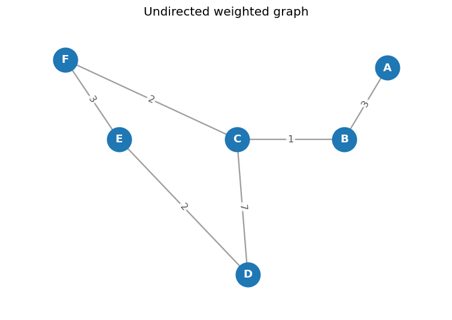

The graph has a single cycle: `C–D–E–F–C` (weights `7, 2, 3, 2`). A spanning tree has $6 - 1 = 5$ edges, so exactly **one** of the six edges will not make the MST — spoiler: it will be the heaviest edge of the cycle, `C–D (7)`.

<a id="code"></a>

### The basic implementation

Here is the implementation from the lecture — the one we walk through step by step (the full version with documentation lives in [`prim_mst/core.py`](prim_mst/core.py)):

```python
from heapq import heappush, heappop

import networkx as nx


def prim_mst(graph):
    # Create an empty MST
    mst = nx.Graph()

    # Visited vertices, starting from an arbitrary initial vertex
    visited = {list(graph.nodes())[0]}

    # A priority queue of edges, initialized with the edges of the start vertex
    edges = []
    for _, v, weight in graph.edges(data='weight', nbunch=visited):
        heappush(edges, (weight, _, v))

    # While the MST does not contain every vertex
    while visited != set(graph.nodes()):
        # Take the smallest-weight edge that connects the tree to a new vertex
        weight, u, v = heappop(edges)
        if v not in visited:
            # Add the new vertex to the MST
            visited.add(v)
            mst.add_edge(u, v, weight=weight)
            # Push all edges of the new vertex into the priority queue
            for _, new_v, new_weight in graph.edges(data='weight', nbunch=[v]):
                if new_v not in visited:
                    heappush(edges, (new_weight, v, new_v))

    return mst
```

What is what:

- `visited` — the vertices already in the tree (the set $S$ from the cut property);
- `edges` — the priority queue: candidate edges `(weight, from, to)`;
- `heappop` hands out the cheapest candidate; `if v not in visited` filters out stale edges (lazy deletion);
- only edges to **not-yet-visited** vertices are pushed — a small optimization that reduces the garbage in the queue (it cannot be eliminated entirely: while an edge waits, its vertex may become visited).

The teaching version [`prim_mst_steps`](prim_mst/core.py) repeats this code **action for action**, but records a snapshot of the state after every event (tree, queue, what was pushed) — every picture below is built from those snapshots.

<a id="init"></a>

### Step 0. Initialization

We start from vertex `A` (the first in the node list — exactly like the basic implementation). The tree = `{A}`, and all edges of `A` go into the queue — here there is just one:

```text
============================================================
Start: initial vertex A
============================================================
Tree = {A}. Edges of A pushed to the queue: (3, A, B)
```

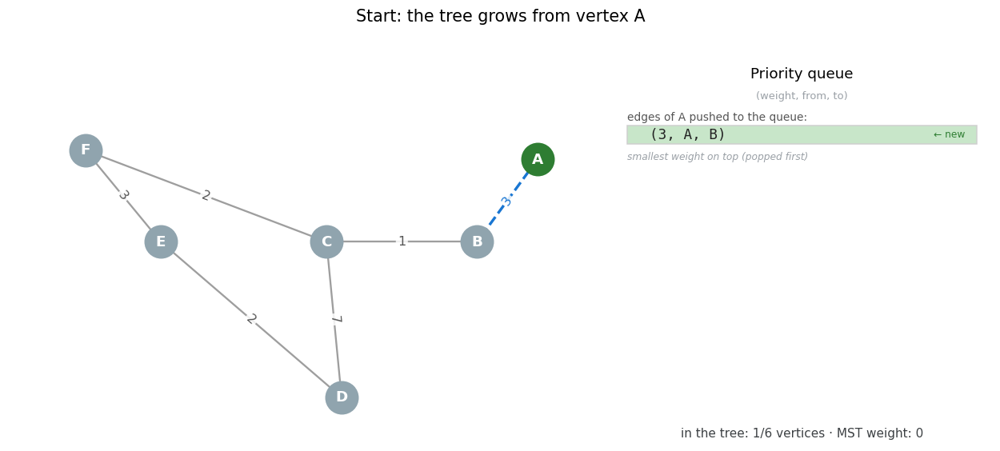

How to read the frames below:

- 🟢 **green vertices and edges** — already in the MST; 🟠 **orange ring** — the vertex added this very step;
- 🔵 **blue dashed edges** — currently in the queue (candidates);
- 🔴 **red edge** — just popped from the queue: solid = accepted, dashed with ✗ = stale;
- on the right — the **priority queue**: the yellow row was just popped, green rows were just pushed, gray rows are stale.

<a id="walkthrough"></a>

### Steps 1–5. The tree grows

#### Step 1: edge `A–B (3)`

The queue holds a single edge — we pop it. `B` is outside → accept. Now the edges of `B` to unvisited vertices go into the queue: just `(1, B, C)` (the edge `B–A` is not pushed — `A` is already in the tree).

```text
============================================================
Step 1: popped edge (3, A, B) from the queue
============================================================
B is NOT in the tree yet → accept: B joins via edge A–B (3).
  Tree: A, B   ·   MST edges: 1/5   ·   weight: 3
  Edges of B pushed to the queue: (1, B, C)
  Queue now: (1, B, C)
```

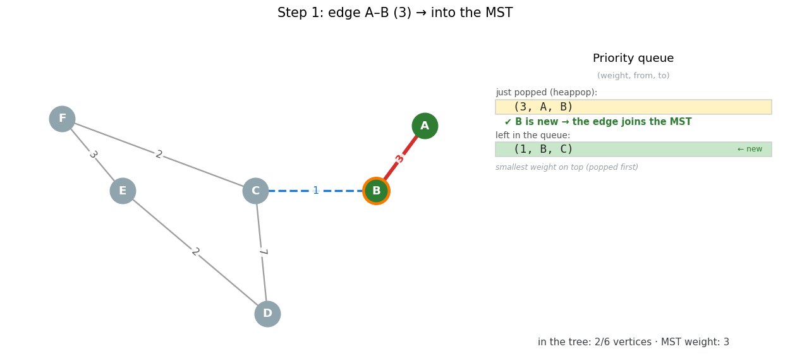

#### Step 2: edge `B–C (1)`

The cheapest (and only) edge in the queue. `C` is outside → accept. `C` is a "fork" of the graph: two of its edges become candidates at once.

```text
============================================================
Step 2: popped edge (1, B, C) from the queue
============================================================
C is NOT in the tree yet → accept: C joins via edge B–C (1).
  Tree: A, B, C   ·   MST edges: 2/5   ·   weight: 4
  Edges of C pushed to the queue: (7, C, D), (2, C, F)
  Queue now: (2, C, F), (7, C, D)
```

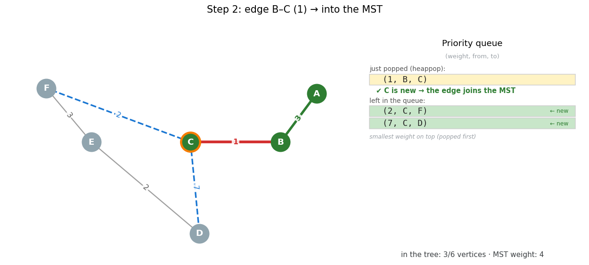

#### Step 3: edge `C–F (2)` — the first real choice

For the first time the queue holds **two** candidates: `(2, C, F)` and `(7, C, D)`. This is exactly the cut "tree `{A, B, C}` vs. `{D, E, F}`" from the [theory section](#cut): precisely these two edges cross it, and Prim takes the cheapest — `C–F (2)`. The pricier `C–D (7)` keeps waiting in the queue.

```text
============================================================
Step 3: popped edge (2, C, F) from the queue
============================================================
F is NOT in the tree yet → accept: F joins via edge C–F (2).
  Tree: A, B, C, F   ·   MST edges: 3/5   ·   weight: 6
  Edges of F pushed to the queue: (3, F, E)
  Queue now: (3, F, E), (7, C, D)
```

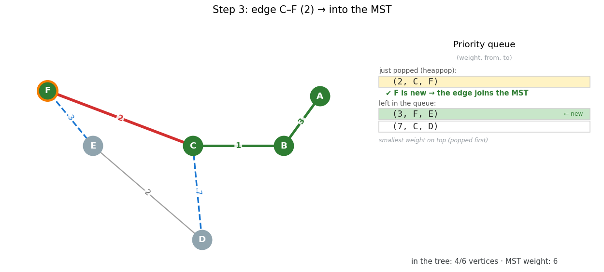

#### Step 4: edge `F–E (3)`

Again a choice of two: `(3, F, E)` vs. `(7, C, D)`. `F–E (3)` wins — and the tree "walks around" the expensive `C–D` along the other side of the cycle.

```text
============================================================
Step 4: popped edge (3, F, E) from the queue
============================================================
E is NOT in the tree yet → accept: E joins via edge F–E (3).
  Tree: A, B, C, E, F   ·   MST edges: 4/5   ·   weight: 9
  Edges of E pushed to the queue: (2, E, D)
  Queue now: (2, E, D), (7, C, D)
```

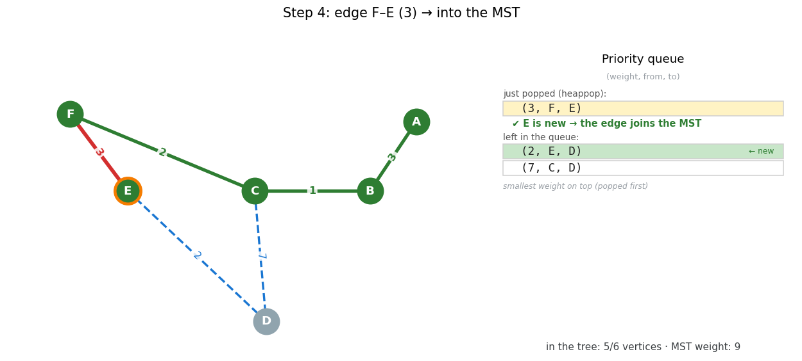

#### Step 5: edge `E–D (2)` — the finish

Two candidates lead to vertex `D`, and both sit in the queue: the fresh `(2, E, D)` and the old `(7, C, D)`. The cheapest is `E–D (2)`: `D` joins, all 6 vertices are in the tree, the `while` loop ends.

```text
============================================================
Step 5: popped edge (2, E, D) from the queue
============================================================
D is NOT in the tree yet → accept: D joins via edge E–D (2).
  Tree: A, B, C, D, E, F   ·   MST edges: 5/5   ·   weight: 11
  No new edges: every neighbour of D is already in the tree.
  Queue now: (7, C, D)
```

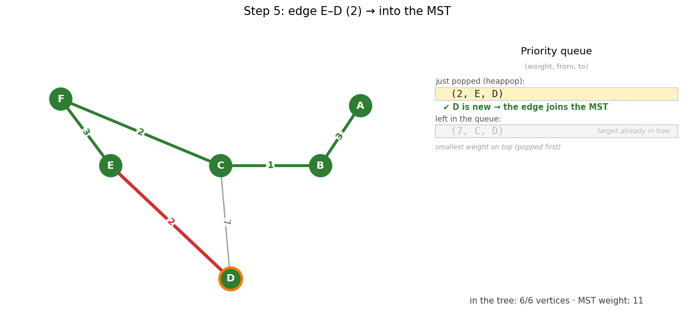

Note that the edge `(7, C, D)` **stayed in the queue** — the algorithm finished before its turn came. With more vertices it would be popped on the next step and skipped as stale (`D` is already in the tree).

<a id="evolution"></a>

### The big picture: evolution of the tree

All states side by side — you can see the tree run around the cycle along its cheaper side, while the edge `C–D (7)` hangs on as a candidate (blue dashed) to the very end and is never needed:

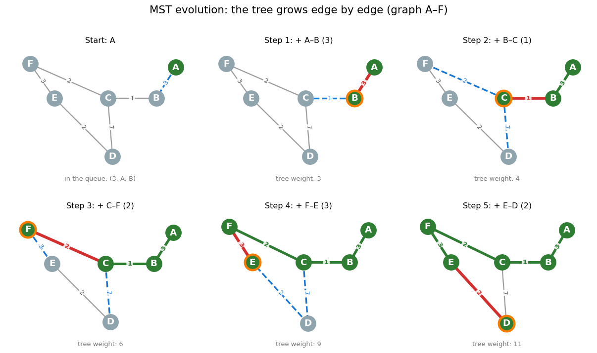

▶️ The same in motion — together with the priority queue at every step:

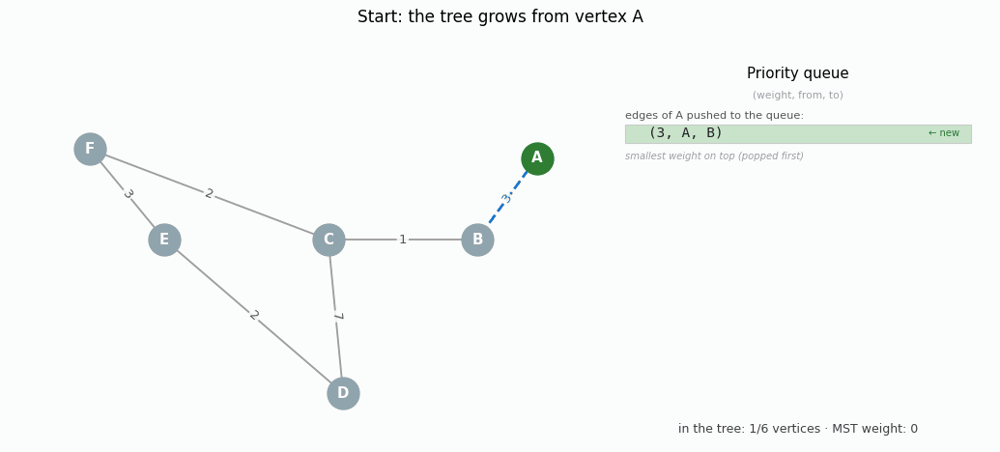

🎬 *MP4 version:* [`evolution_abcdef.mp4`](docs/images/en/evolution_abcdef.mp4)

<a id="result"></a>

### Result: the MST and the rejected edge

The total weight: $3 + 1 + 2 + 3 + 2 = 11$. The output of the basic implementation:

```text
Edges in the MST:
('A', 'B', {'weight': 3})
('B', 'C', {'weight': 1})
('C', 'F', {'weight': 2})
('F', 'E', {'weight': 3})
('E', 'D', {'weight': 2})
MST weight: 11   (edges: 5 of 6 possible)
Left out of the MST: C–D (7)
```

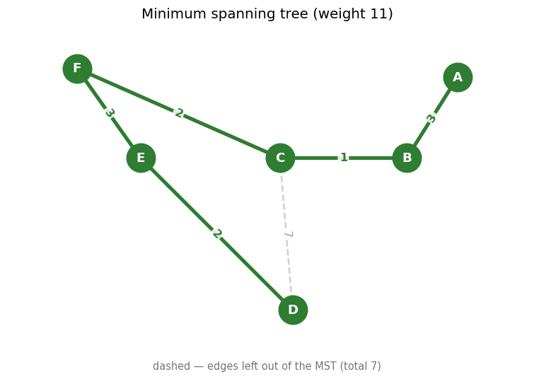

The rejected edge is no accident. It illustrates the **cycle property**, the mirror image of the cut property: **the heaviest edge of any cycle is needed by no MST** — it can always be replaced by the rest of the cycle. Our graph has a single cycle (`C–D–E–F–C`), and its heaviest edge `C–D (7)` is exactly the one that fell out.

For comparison: in the Floyd–Warshall walkthrough on this very graph (directed), the shortest path `A → D` cost `11` via `A → B → C → D`. The matching number `11` is a coincidence; the difference between the problems is fundamental: an MST is **one shared infrastructure** for all vertices, not a set of shortest routes between pairs.

---

<a id="example-2"></a>
<a id="lazy-example"></a>

## Example 2 — the lecture graph `A–G`: lazy deletion in action

This is the graph from the basic implementation's demo: 7 vertices, 11 edges — finally "dense" enough for stale edges to pile up in the queue.

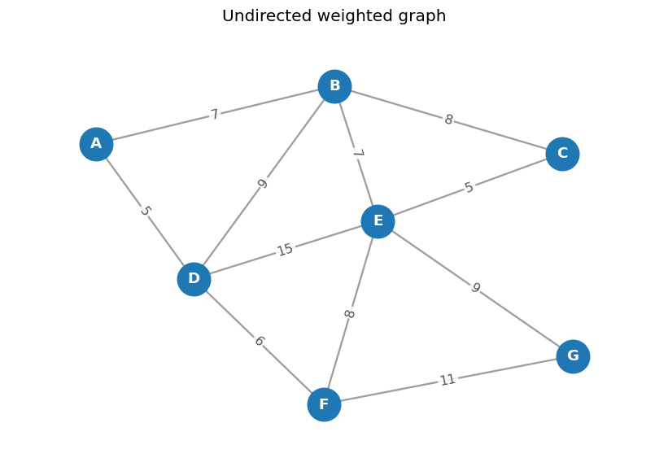

The first five steps are ordinary tree growth (the full journal is printed by [`examples/02_lazy_deletion_abcdefg.py`](examples/02_lazy_deletion_abcdefg.py)):

```text
Start:  tree = {A};  queue (5, A, D), (7, A, B)
Step 1: + A–D (5)   → pushed (9, D, B), (15, D, E), (6, D, F)
Step 2: + D–F (6)   → pushed (8, F, E), (11, F, G)
Step 3: + A–B (7)   → pushed (8, B, C), (7, B, E)
Step 4: + B–E (7)   → pushed (5, E, C), (9, E, G)
Step 5: + E–C (5)   → nothing new (every neighbour of C is already in the tree)
```

After step 5 the tree holds six of the seven vertices (only `G` is missing), while the queue has accumulated six edges — and **four of them are already stale** (both endpoints in the tree). Now the interesting part: three times in a row the algorithm pops a stale edge and skips it.

#### Step 6: edge `(8, B, C)` — stale

When this edge entered the queue (step 3), `C` was outside. But on step 5 vertex `C` was claimed by the **cheaper** edge `E–C (5)`. Now `if v not in visited` is false — the edge is silently skipped:

```text
============================================================
Step 6: popped edge (8, B, C) from the queue
============================================================
C is ALREADY in the tree → the edge is stale (“lazy deletion”), skipped.
  Tree unchanged: A, B, C, D, E, F   ·   weight: 30
  Queue now: (8, F, E), (9, D, B), (9, E, G), (11, F, G), (15, D, E)
```

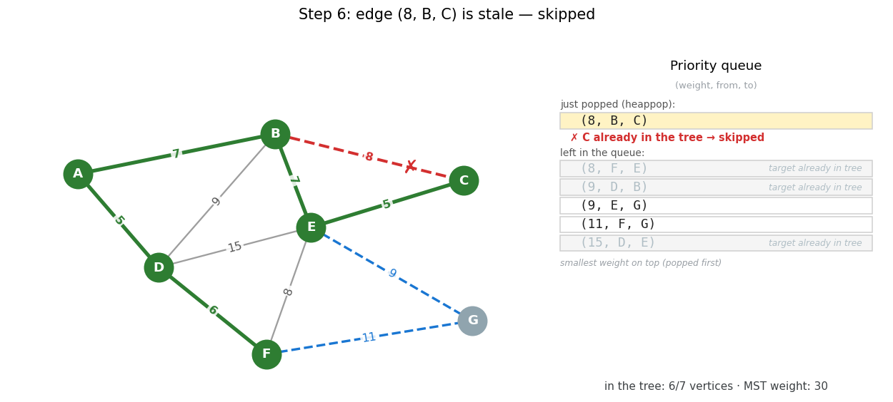

The queue panel shows the fate of the remaining candidates: the gray rows `(8, F, E)`, `(9, D, B)`, `(15, D, E)` are stale too and await the same destiny.

#### Steps 7–8: two more skips

```text
Step 7: (8, F, E) → E already in the tree, skipped
Step 8: (9, D, B) → B already in the tree, skipped
```

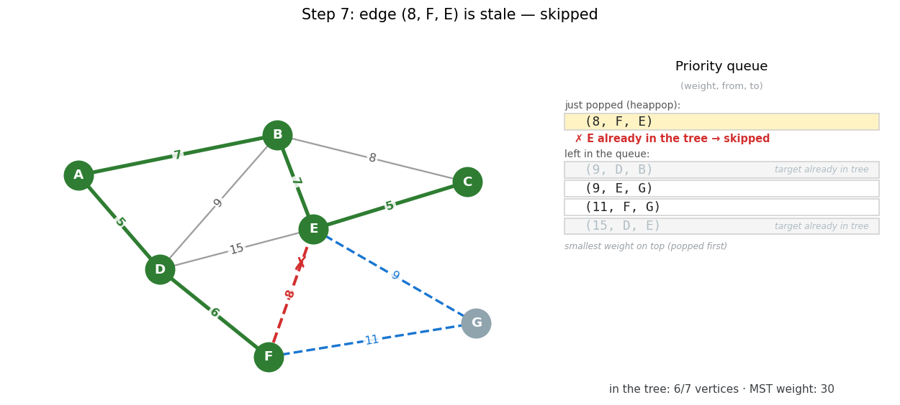

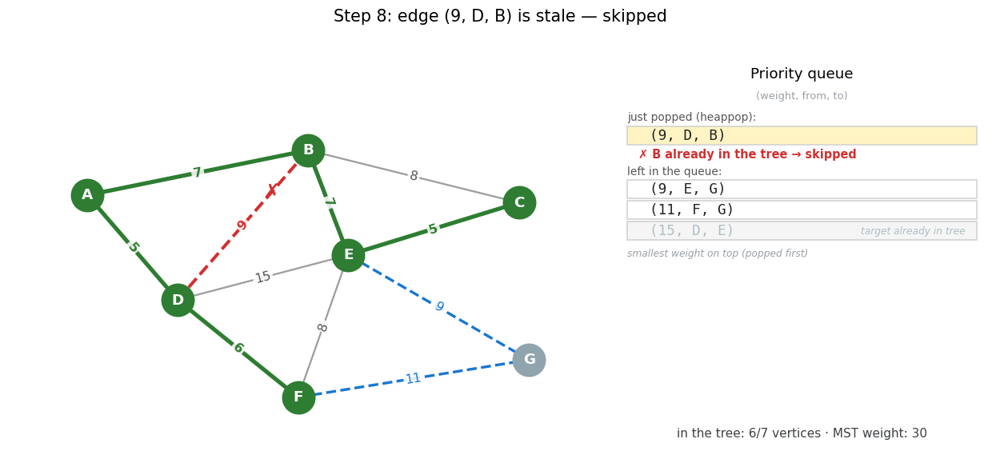

#### Step 9: edge `E–G (9)` — the finish

At last the queue hands out a useful edge — the final vertex `G` joins via `E–G (9)`:

```text
============================================================
Step 9: popped edge (9, E, G) from the queue
============================================================
G is NOT in the tree yet → accept: G joins via edge E–G (9).
  Tree: A, B, C, D, E, F, G   ·   MST edges: 6/6   ·   weight: 39
  No new edges: every neighbour of G is already in the tree.
  Queue now: (11, F, G), (15, D, E)
```

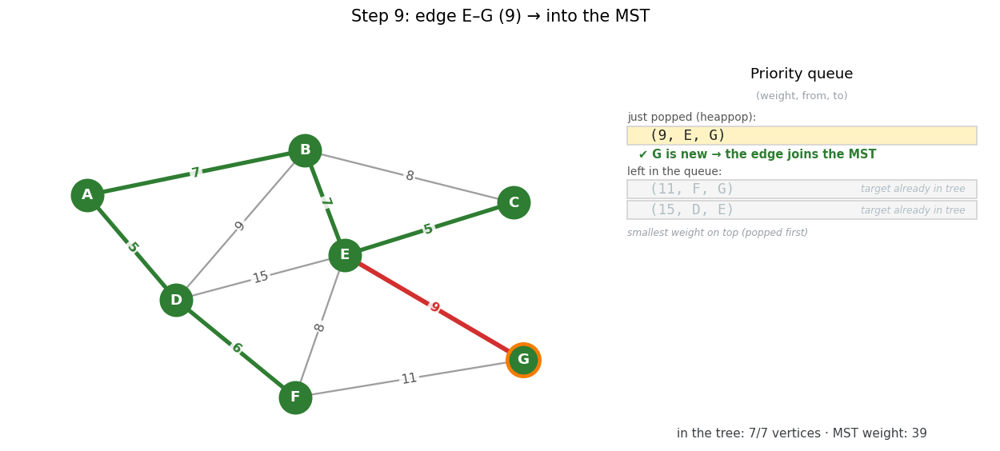

The summary (compare with the lecture demo output of the basic implementation — it is the same):

```text
Edges in the MST:
('A', 'D', {'weight': 5})
('A', 'B', {'weight': 7})
('D', 'F', {'weight': 6})
('B', 'E', {'weight': 7})
('E', 'C', {'weight': 5})
('E', 'G', {'weight': 9})
MST weight: 39   (edges: 6 of 11 possible)
Left out of the MST: B–C (8), B–D (9), D–E (15), E–F (8), F–G (11)
```

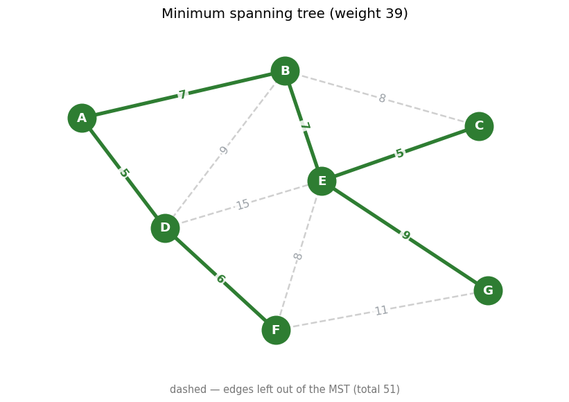

The whole evolution at a glance — skips are marked with ✗:

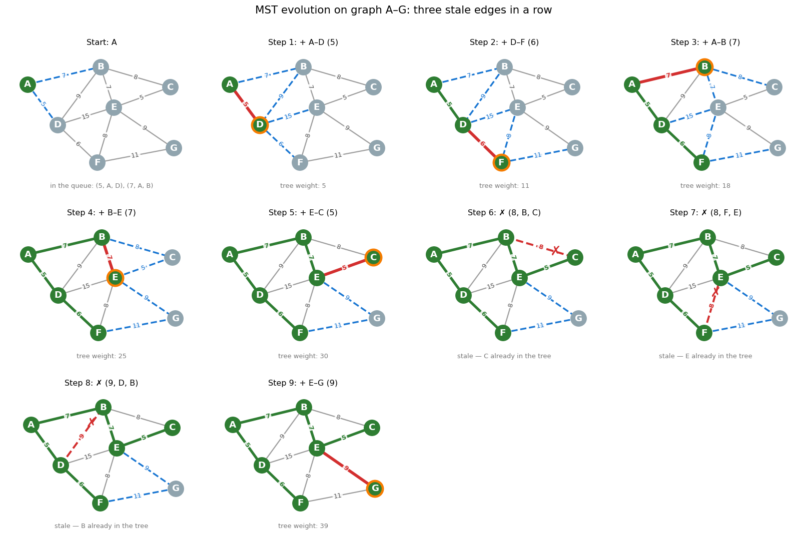

▶️ The animated version with the queue at every step:

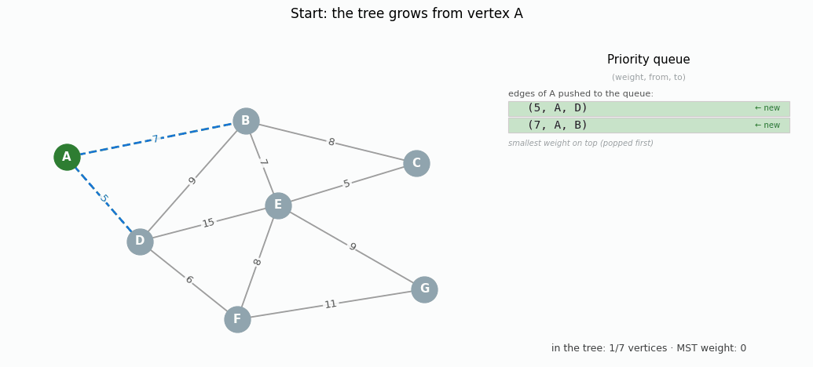

🎬 *MP4 version:* [`evolution_abcdefg.mp4`](docs/images/en/evolution_abcdefg.mp4)

**The moral of the example.** Lazy deletion is a trade-off: the queue holds up to $O(E)$ entries and occasionally hands out garbage, but every operation is a plain `heappush`/`heappop` with no extra bookkeeping. The garbage-free alternative is the [eager version](#eager) below.

---

<a id="disconnected"></a>

## A limitation: disconnected graphs

A spanning tree **exists only for a connected graph**: if the graph falls apart into "islands", no set of edges will join them. What happens if you run Prim anyway?

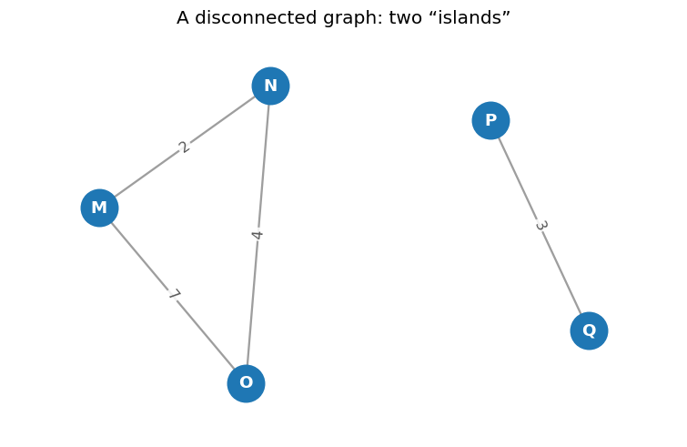

```text
Is the graph connected? nx.is_connected → False
Connected components: {M, N, O}; {P, Q}

Running the basic prim_mst on a disconnected graph…
  💥 IndexError: heappop from an empty queue.
  The tree covered the start component, while vertices P, Q are unreachable —
  so the condition `visited != set(graph.nodes())` never becomes false.
```

The mechanics of the failure: the tree quickly absorbs the entire start component (`M, N, O`), no new edges arrive in the queue, the queue runs dry — while the loop `while visited != set(graph.nodes())` still waits for `P` and `Q`. The next `heappop` crashes with an `IndexError`.

> **The sneakier variant.** The [eager version](#eager) does not crash here — it **silently** returns the tree of one component; the result looks plausible but is not a spanning tree. A loud error beats a silent one: check connectivity up front.

The honest ways out:

1. **Check beforehand:** `nx.is_connected(graph)` — and report the problem explicitly.
2. **Build a minimum spanning forest:** a separate MST in every component. That is what [`prim_msf`](prim_mst/core.py) does — Prim runs inside each component separately:

```text
Minimum spanning forest (prim_msf): 3 edges, weight 9.
```

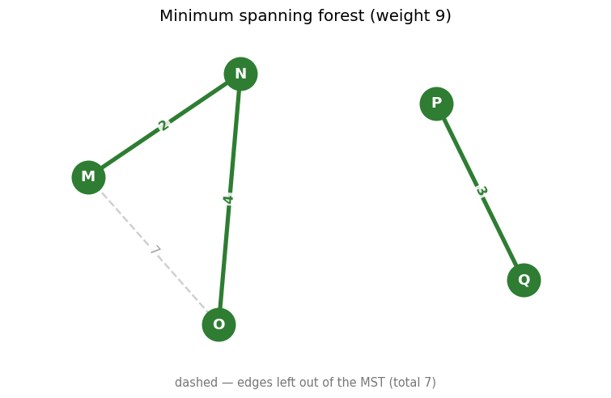

Inside component `{M, N, O}` the heaviest edge of its cycle was rejected (`M–O (7)` — the cycle property again), and the island `{P, Q}` got its single edge.

---

<a id="code-walkthrough"></a>

## Step-by-step code execution: code ↔ graph ↔ queue panels

The examples above showed the *result* of every step. Here is **the code itself in action**: on the left a fragment of the algorithm with the **active lines highlighted**, in the middle the graph, on the right the priority queue at that very moment. **The colour of a code line encodes which branch fired:** 🟨 the line is executing now, 🟩 the condition `if v not in visited` is true → the edge is accepted, 🟥 the vertex is already in the tree → the edge is skipped.

Both artifacts are built from one journal of snapshots ([`prim_mst/walkthrough.py`](prim_mst/walkthrough.py)); they are generated by [`examples/05_code_walkthrough.py`](examples/05_code_walkthrough.py).

### Graph `A–F`: one row per popped edge

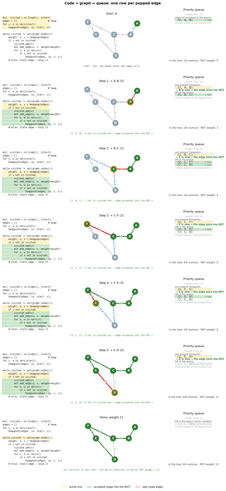

▶️ The animated version — between the "resolutions" it inserts "`heappop`: checking the vertex" frames (the yellow row of the queue is what gets popped next):

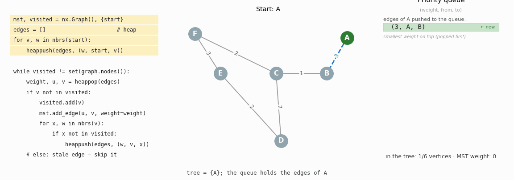

🎬 *MP4 version:* [`code_walk_abcdef.mp4`](docs/images/en/code_walk_abcdef.mp4)

### Graph `A–G`: both branches of the `if` visible

On steps 6–8 the **red** branch fires (the edge is stale — skip) — in the static grid those rows stand out immediately:

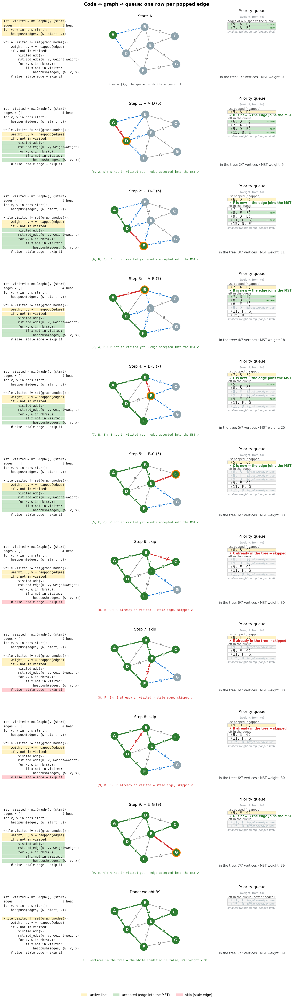

▶️ Animation:

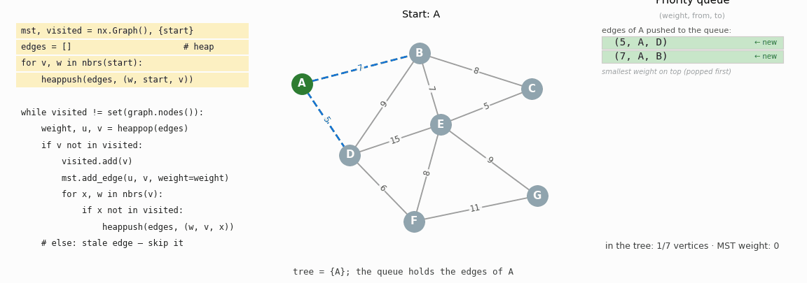

🎬 *MP4 version:* [`code_walk_abcdefg.mp4`](docs/images/en/code_walk_abcdefg.mp4)

---

<a id="complexity"></a>

## Complexity and comparison

**The basic (lazy) version:** every edge can enter the queue at most twice (once from each endpoint), so the queue holds up to $O(E)$ entries and each operation costs $O(\log E)$. In total — $O(E \log E)$ time and $O(E)$ memory for the queue. Since $E \le V^2$, we have $\log E \le 2 \log V$ — i.e. this equals $O(E \log V)$ up to a constant.

**The eager version** (a binary heap with decrease-key, or a "best edge per vertex" dictionary): the queue holds at most $V$ entries — $O(E \log V)$ time and $O(V)$ memory. With a Fibonacci heap — theoretically $O(E + V \log V)$ (rarely worth the implementation complexity in practice).

| Algorithm | Complexity | Strategy | Best when |
|---|---|---|---|
| **Prim (lazy, heap)** | $O(E \log E)$ | the tree grows from a vertex | simple code, dense graphs |
| Prim (eager, heap) | $O(E \log V)$ | same + decrease-key | queue memory matters |
| Kruskal | $O(E \log E)$ | sort the edges, stitch a forest (DSU) | sparse graphs, pre-sorted edges |
| Borůvka | $O(E \log V)$ | all components grow in parallel | parallel / distributed settings |

Prim and Kruskal produce the **same weight** of the MST (and, with distinct edge weights, the same tree); the difference is only the order in which edges are accepted: Prim grows **one** tree from the start vertex, while Kruskal keeps a **forest** and at every step takes the globally cheapest edge that does not create a cycle.

**Does the result depend on the start vertex?** The weight — never. The tree itself — also no, when all weights are distinct (the MST is then unique). With equal weights different but equally minimal trees are possible; in our examples the MSTs are unique, so any start works.

<a id="applications"></a>

## Where it is used

The same "connect everything as cheaply as possible" surfaces in very different problems:

- **Network design.** Power grids, fibre optics, pipelines, PCB routing: the nodes must be joined into one network of minimum cost. Historically this is where the algorithm came from (Otakar Borůvka was electrifying Moravia in 1926; Prim rediscovered his algorithm at Bell Labs for telephone networks).
- **Clustering.** Build an MST over the data points and remove the $k-1$ heaviest edges — you get $k$ clusters (this is single-linkage clustering in MST terms).
- **Approximating the travelling salesman.** For metric TSP, walking around the MST yields a route at most **twice** the optimum — the classic 2-approximation.
- **Maze generation.** Prim on a grid with random weights yields a perfect maze: exactly one path between any two cells (a spanning tree has no cycles).
- **Image segmentation.** Pixels are vertices, neighbour similarity gives the weights: the MST view underlies graph-based segmentation methods (e.g. Felzenszwalb–Huttenlocher).

The common trait: you need **one shared connecting structure** of minimum total weight, not shortest routes between pairs.

<a id="eager"></a>

## Bonus: the eager version (a duplicate-free queue)

The lazy queue can be "disciplined": instead of all edges, keep for every vertex outside the tree only the **best known** edge to the tree. Found a cheaper one — update the record (*decrease-key* semantics). Then the queue never holds duplicates or stale edges, and the memory is $O(V)$ instead of $O(E)$. The dictionary implementation (see [`prim_mst_eager`](prim_mst/core.py)):

```python
def prim_mst_eager(graph, start):
    mst = nx.Graph()
    visited = {start}
    # best[v] = (weight, u): the cheapest known edge connecting v to the tree
    best = {v: (w, start) for _, v, w in graph.edges(data='weight', nbunch=[start])}

    while best:
        v = min(best, key=lambda x: (best[x][0], str(x)))   # the cheapest candidate
        weight, u = best.pop(v)
        visited.add(v)
        mst.add_edge(u, v, weight=weight)
        for _, x, w in graph.edges(data='weight', nbunch=[v]):
            if x not in visited and (x not in best or w < best[x][0]):
                best[x] = (w, v)        # decrease-key: found a cheaper edge to x

    return mst
```

This `min`-over-a-dictionary version is $O(V^2 + E)$: for **dense** graphs ($E \approx V^2$) that is actually optimal and faster than any heap. For sparse graphs, replace the dictionary with a decrease-key heap to get $O(E \log V)$. On both teaching graphs the eager version builds the same trees as the lazy one (verified by the [tests](tests/test_core.py)).

<a id="summary"></a>

## Summary

- An **MST** is the cheapest set of edges connecting all vertices without cycles; a tree on $n$ vertices has exactly $n-1$ edges.
- **Prim is greedy:** the tree grows from one vertex, each step attaching the cheapest edge across the cut "tree ↔ the rest".
- The greed is **provably safe** — the cut property (and the rejected edges are explained by the mirror cycle property: the heaviest edge of a cycle is never needed).
- The workhorse is a **priority queue** of `(weight, from, to)`; stale edges are filtered by **lazy deletion** — the single line `if v not in visited`.
- On graph `A–F` (the same one as in Floyd–Warshall) the MST weighs **11**, rejecting the heaviest edge of the only cycle — `C–D (7)`; on the lecture graph `A–G` — weight **39** with three stale-edge skips in a row.
- Prim requires a **connected** graph: otherwise the basic implementation crashes (`IndexError`), and the honest answer is a minimum spanning **forest** (`prim_msf`).
- The basic version runs in $O(E \log E)$; the eager version keeps an $O(V)$ duplicate-free queue.

---

<a id="license"></a>

## License

[MIT](LICENSE) © 2026 Maryna Shavlak
