# Алгоритм Прима: покроковий розбір

[](https://github.com/MarynaShavlak/algo-prim)

**🇺🇦 Українська**  ·  [🇬🇧 English](README.en.md)

**Алгоритм Прима** будує **мінімальне остовне дерево** (МОД, minimum spanning tree) у зв'язному неорієнтованому зваженому графі: обирає з усіх ребер такий набір, що з'єднує **всі** вершини **без циклів** і має **найменшу сумарну вагу**.

Це класичний приклад **жадібного алгоритму**: дерево росте з однієї вершини, і на кожному кроці до нього приєднується **найдешевше** ребро, що веде назовні. Локально найвигідніший вибір тут гарантовано складається в глобально оптимальну відповідь — і нижче ми розберемо, чому (властивість розрізу).

Репозиторій — навчальний матеріал: чиста реалізація алгоритму + докладні візуалізації кожного кроку. Увесь розбір нижче відтворюється кодом із [`examples/`](examples), а рисунки лежать у [`docs/images/`](docs/images).

> **Про граф.** Основний приклад — **той самий граф `A–F`**, що й у сусідньому розборі [алгоритму Флойда–Воршала](https://github.com/MarynaShavlak/algo-floyd-warshall): ті самі шість ребер із тими самими вагами й навіть ті самі координати вершин на рисунках. Різниця одна: там граф був **орієнтований** (найкоротші шляхи залежать від напрямку), а МОД визначено для **неорієнтованих** графів — тож стрілки знято, і кожне ребро тепер можна проходити в обидва боки.

---

## Зміст

- [Структура репозиторію](#repo-structure)
- [Швидкий старт](#quickstart)
- **Теорія**
  - [Інтуїція: кабельна мережа](#intuition)
  - [Ідея Прима: дерево, що росте](#idea)
  - [Чому жадібний вибір безпечний: властивість розрізу](#cut)
  - [Черга з пріоритетами і «ліниве видалення»](#lazy)
- **Приклад 1 — граф `A–F` (той самий, що у Флойда–Воршала)**
  - [Граф із прикладу](#graph)
  - [Базова реалізація](#code)
  - [Крок 0. Ініціалізація](#init)
  - [Кроки 1–5. Дерево росте](#walkthrough)
  - [Зведена картина: еволюція дерева](#evolution)
  - [Результат: МОД і відкинуте ребро](#result)
- **Приклад 2 — граф `A–G` з лекції**
  - [«Ліниве видалення» в дії: три застарілі ребра поспіль](#lazy-example)
- **Обмеження**
  - [Незв'язний граф: чому Прим «вибухає» і що з цим робити](#disconnected)
- [Покрокове виконання коду: панелі «код ↔ граф ↔ черга»](#code-walkthrough)
- **Підсумки**
  - [Складність і порівняння](#complexity)
  - [Де це застосовується](#applications)
  - [Бонус: eager-версія (черга без дублікатів)](#eager)
  - [Підсумок](#summary)
- [Ліцензія](#license)

---

<a id="repo-structure"></a>

## Структура репозиторію

Дерево каталогів і розподіл відповідальностей між модулями винесено в окремий файл — **[PROJECT_STRUCTURE.md](PROJECT_STRUCTURE.md)**.

---

<a id="quickstart"></a>

## Швидкий старт

Команди встановлення, запуску прикладів і тестів, а також мінімальний приклад використання як бібліотеки — у файлі **[USAGE.md](USAGE.md)**.

---

<a id="intuition"></a>

## Інтуїція: кабельна мережа

Уявіть вершини як **міста**, а ребра — як **можливі траси кабелю** з вартістю прокладання. Завдання: щоб кожне місто було з'єднане з кожним (хоч би й транзитом через інші міста), а сумарна вартість прокладеного кабелю була **найменшою**.

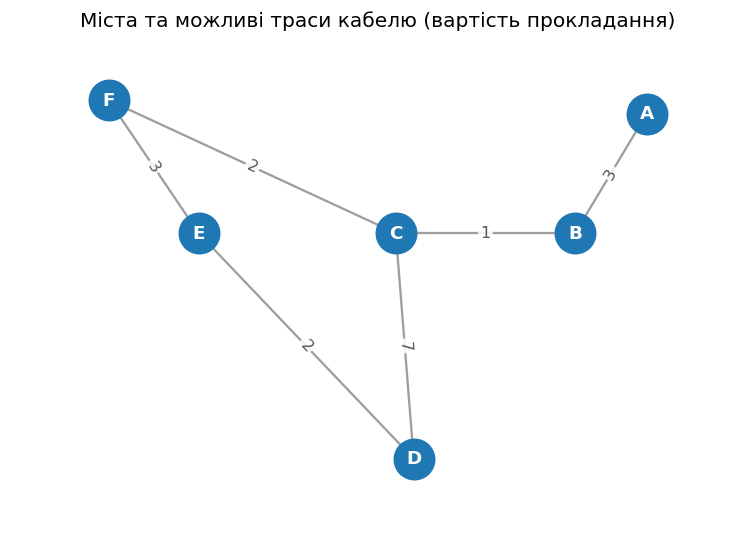

Два спостереження одразу спрощують задачу:

1. **Цикли — це зайві витрати.** Якщо прокладені кабелі утворюють цикл, будь-який кабель цього циклу можна прибрати — зв'язність не постраждає, а вартість зменшиться. Отже, оптимальний план — **дерево**.
2. **Дерево на $n$ містах має рівно $n-1$ кабель.** Менше — хтось відрізаний; більше — є цикл.

Залишається обрати **найдешевше** з усіх можливих дерев — це і є мінімальне остовне дерево:

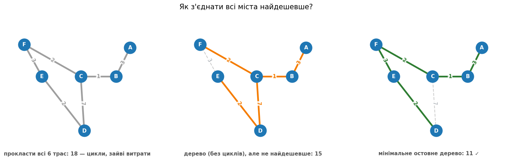

▶️ Те саме в русі — три плани по черзі (усі траси за 18 → дерево за 15 → МОД за 11):

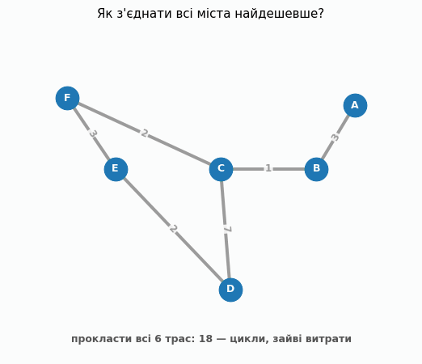

🎬 *MP4-версія:* [`cable_plans_abcdef.mp4`](docs/images/cable_plans_abcdef.mp4)

Зверніть увагу: МОД мінімізує **сумарну вартість мережі**, а не відстані між парами міст. Найкоротші шляхи між парами — це задача Флойда–Воршала чи Дейкстри; тут питання інше: *якою найдешевшою інфраструктурою з'єднати всіх*.

<a id="idea"></a>

## Ідея Прима: дерево, що росте

Прим будує МОД так, як росте кристал у розчині:

1. **Старт** — будь-яка одна вершина (дерево з одного «міста»).
2. На кожному кроці дивимось на **всі ребра, що з'єднують дерево із зовнішніми вершинами**, і беремо **найдешевше** з них.
3. Ребро та його нова вершина приєднуються до дерева. Повторюємо, доки в дереві не опиняться всі вершини — рівно $n-1$ прийнятих ребер.

Дерево **завжди лишається одним зв'язним шматком** — воно саме «обростає» новими вершинами (порівняйте з Краскалом, який тримає ліс із багатьох шматків і зшиває їх).

Ребро, що веде з дерева в дерево, не розглядається ніколи: воно замкнуло б цикл, а цикли нам не потрібні.

<a id="cut"></a>

## Чому жадібний вибір безпечний: властивість розрізу

Жадібні алгоритми часто дають неоптимальні відповіді, тож «беремо найдешевше — і все буде добре» потребує доведення. Для МОД його дає **властивість розрізу** (cut property).

**Розріз** — це поділ усіх вершин на дві непорожні частини. Нас цікавить розріз «дерево $S$ проти решти вершин $V \setminus S$»:

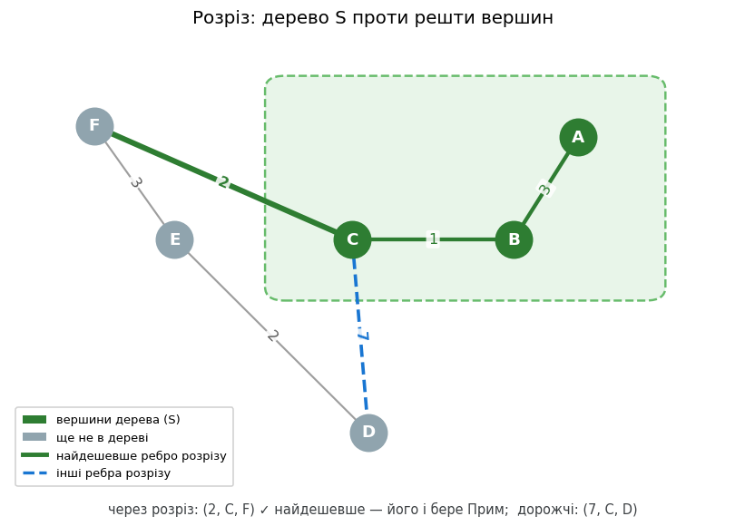

> **Властивість розрізу.** Нехай $S$ — будь-яка множина вершин, а $e$ — **найдешевше** ребро, що перетинає розріз ($один кінець у $S$, інший — поза$). Тоді існує мінімальне остовне дерево, яке містить $e$. *(Якщо всі ваги різні — $e$ лежить у **кожному** МОД.)*

**Доведення обміном (ідея).** Візьмімо будь-яке остовне дерево $T$, що *не* містить $e = (u, v)$. У $T$ між $u$ і $v$ є шлях, і хоча б одне його ребро $f$ теж перетинає розріз (шлях мусить колись «перестрибнути» з $S$ назовні). Замінимо $f$ на $e$: зв'язність збережеться, циклів не з'явиться, а вага не зросте, бо $w(e) \le w(f)$ — адже $e$ найдешевше через розріз. Отже, $T$ без $e$ ніколи не буває *строго кращим*.

Прим на кожному кроці робить рівно це: його розріз — «уже збудоване дерево проти решти», і він додає найдешевше ребро через цей розріз. Кожен крок безпечний → підсумкове дерево мінімальне.

▶️ Властивість розрізу в русі на нашому графі — перед кожним кроком видно всі ребра через розріз (сині пунктирні) і найдешевше з них (зелене), яке й забирає алгоритм:

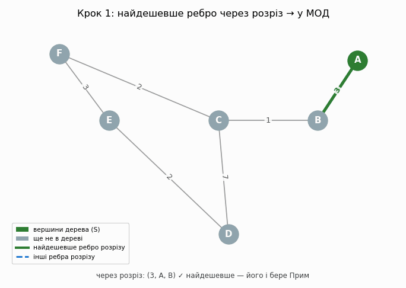

🎬 *MP4-версія:* [`cut_steps_abcdef.mp4`](docs/images/cut_steps_abcdef.mp4)

<a id="lazy"></a>

## Черга з пріоритетами і «ліниве видалення»

«Узяти найдешевше ребро через розріз» наївно — це перебрати всі ребра на кожному кроці: $O(E)$ раз $n$ кроків. Швидше — тримати ребра-кандидати в **черзі з пріоритетами** (двійкова купа, модуль `heapq`):

- коли вершина $v$ приєднується до дерева, **усі** ребра з $v$ до ще не відвіданих вершин ідуть у чергу (`heappush`);
- черга віддає ребро з **найменшою вагою** за $O(\log E)$ (`heappop`).

Елемент черги — кортеж **`(вага, звідки, куди)`**. Python порівнює кортежі лексикографічно: спершу вага, за рівності — імена вершин. Тому порядок зняття повністю детермінований і «нічия» вирішується за алфавітом.

**Тонкість:** черга не вміє «забути» ребро, яке вже нікому не потрібне. Поки ребро $(w, u, v)$ чекало своєї черги, вершина $v$ могла приєднатися до дерева **іншим, дешевшим шляхом**. Таке ребро називають **застарілим** (stale). Прим розв'язує це **лінивим видаленням** (lazy deletion): нічого не шукаємо й не видаляємо заздалегідь — просто, знявши ребро з черги, перевіряємо:

```python
if v not in visited:   # вершина ще зовні? → приймаємо ребро
    ...
# інакше ребро застаріле — мовчки пропускаємо
```

Саме цей рядок — серце базової реалізації. У прикладі 1 застарілих ребер не виникне (граф маленький), а от у [прикладі 2](#lazy-example) алгоритм пропустить **три** застарілі ребра поспіль.

---

<a id="example-1"></a>

## Приклад 1 — граф `A–F` (той самий, що у Флойда–Воршала)

<a id="graph"></a>

### Граф із прикладу

Працюємо з **неорієнтованим зваженим** графом: 6 вершин, 6 ребер.

| ребро | A–B | B–C | C–D | C–F | D–E | E–F |
|---|---|---|---|---|---|---|
| **вага** | 3 | 1 | 7 | 2 | 2 | 3 |

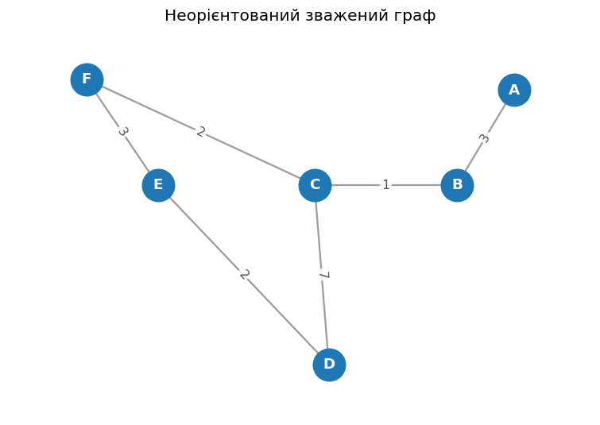

У графі один цикл: `C–D–E–F–C` (ваги `7, 2, 3, 2`). Остовне дерево має $6 - 1 = 5$ ребер, тож рівно **одне** з шести ребер у МОД не потрапить — забіжимо наперед: це буде найважче ребро циклу, `C–D (7)`.

<a id="code"></a>

### Базова реалізація

Ось реалізація з лекції — її ми й розбираємо крок за кроком (повна версія з документацією — у [`prim_mst/core.py`](prim_mst/core.py)):

```python
from heapq import heappush, heappop

import networkx as nx


def prim_mst(graph):
    # Створення порожнього МОД
    mst = nx.Graph()

    # Відвідані вершини, починаючи з випадкової початкової вершини
    visited = {list(graph.nodes())[0]}

    # Черга з пріоритетами для ребер, яка ініціалізується ребрами початкової вершини
    edges = []
    for _, v, weight in graph.edges(data='weight', nbunch=visited):
        heappush(edges, (weight, _, v))

    # Поки в МОД не всі вершини
    while visited != set(graph.nodes()):
        # Вибираємо ребро з найменшою вагою, що з'єднує дерево з новою вершиною
        weight, u, v = heappop(edges)
        if v not in visited:
            # Додаємо нову вершину до МОД
            visited.add(v)
            mst.add_edge(u, v, weight=weight)
            # Додаємо всі ребра з нової вершини до черги з пріоритетами
            for _, new_v, new_weight in graph.edges(data='weight', nbunch=[v]):
                if new_v not in visited:
                    heappush(edges, (new_weight, v, new_v))

    return mst
```

Що тут що:

- `visited` — вершини, які вже в дереві (множина $S$ із властивості розрізу);
- `edges` — черга з пріоритетами: ребра-кандидати `(вага, звідки, куди)`;
- `heappop` віддає найдешевшого кандидата; `if v not in visited` відсіює застарілі ребра (ліниве видалення);
- у чергу йдуть лише ребра до **ще не відвіданих** вершин — дрібна оптимізація, що зменшує кількість сміття в черзі (зовсім позбутися його не можна: поки ребро чекає, його вершина може стати відвіданою).

Навчальна версія [`prim_mst_steps`](prim_mst/core.py) повторює цей код **дія в дію**, але після кожної події записує знімок стану (дерево, черга, що додалося) — саме з цих знімків зібрані всі картинки нижче.

<a id="init"></a>

### Крок 0. Ініціалізація

Стартуємо з вершини `A` (перша в списку вершин — як у базовій реалізації). Дерево = `{A}`, а в чергу лягають усі ребра з `A` — тут воно одне:

```text
============================================================
Старт: початкова вершина A
============================================================
Дерево = {A}. До черги покладено ребра з A: (3, A, B)
```

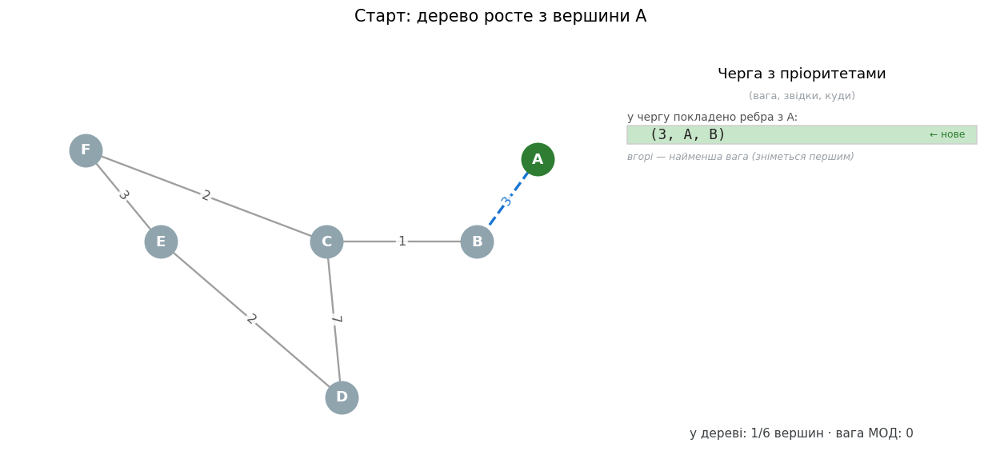

Як читати кадри нижче:

- 🟢 **зелені вершини й ребра** — уже в МОД; 🟠 **помаранчеве кільце** — вершина, додана щойно;
- 🔵 **сині пунктирні ребра** — зараз лежать у черзі (кандидати);
- 🔴 **червоне ребро** — щойно зняте з черги: суцільне = прийнято, пунктир із ✗ = застаріле;
- праворуч — **черга з пріоритетами**: жовтий рядок — щойно знятий, зелені — щойно додані, сірі — застарілі.

<a id="walkthrough"></a>

### Кроки 1–5. Дерево росте

#### Крок 1: ребро `A–B (3)`

У черзі єдине ребро — його й знімаємо. `B` зовні → приймаємо. Тепер у чергу йдуть ребра з `B` до невідвіданих вершин: лише `(1, B, C)` (ребро `B–A` не кладемо — `A` вже в дереві).

```text
============================================================
Крок 1: знято з черги ребро (3, A, B)
============================================================
B ще НЕ в дереві → приймаємо: B приєднується ребром A–B (3).
  Дерево: A, B   ·   ребер у МОД: 1/5   ·   вага: 3
  До черги додано ребра з B: (1, B, C)
  Черга тепер: (1, B, C)
```

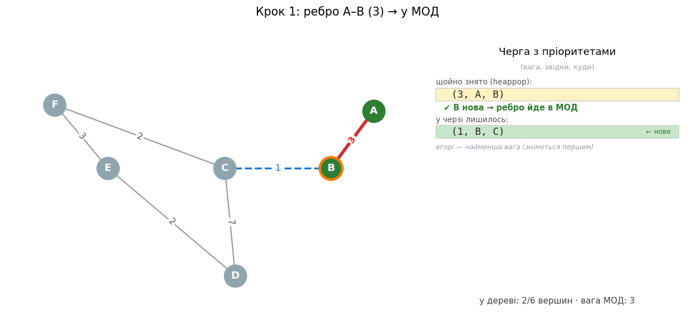

#### Крок 2: ребро `B–C (1)`

Найдешевше (і єдине) у черзі. `C` зовні → приймаємо. `C` — «розгалуження» графа: одразу два його ребра стають кандидатами.

```text
============================================================
Крок 2: знято з черги ребро (1, B, C)
============================================================
C ще НЕ в дереві → приймаємо: C приєднується ребром B–C (1).
  Дерево: A, B, C   ·   ребер у МОД: 2/5   ·   вага: 4
  До черги додано ребра з C: (7, C, D), (2, C, F)
  Черга тепер: (2, C, F), (7, C, D)
```

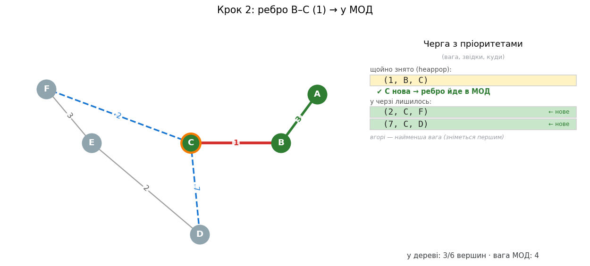

#### Крок 3: ребро `C–F (2)` — перший справжній вибір

У черзі вперше **два** кандидати: `(2, C, F)` і `(7, C, D)`. Це і є розріз «дерево `{A, B, C}` проти `{D, E, F}`» із [розділу про теорію](#cut): через нього проходять рівно ці два ребра, і Прим бере найдешевше — `C–F (2)`. Дорожче `C–D (7)` лишається чекати в черзі.

```text
============================================================
Крок 3: знято з черги ребро (2, C, F)
============================================================
F ще НЕ в дереві → приймаємо: F приєднується ребром C–F (2).
  Дерево: A, B, C, F   ·   ребер у МОД: 3/5   ·   вага: 6
  До черги додано ребра з F: (3, F, E)
  Черга тепер: (3, F, E), (7, C, D)
```

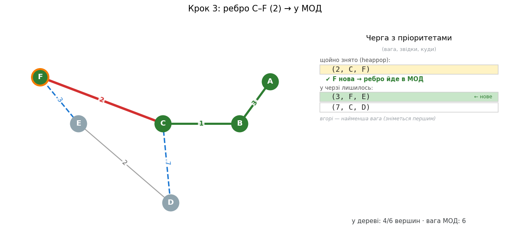

#### Крок 4: ребро `F–E (3)`

Знову вибір із двох: `(3, F, E)` проти `(7, C, D)`. Бере гору `F–E (3)` — і дерево «обходить» дорогу `C–D` з іншого боку циклу.

```text
============================================================
Крок 4: знято з черги ребро (3, F, E)
============================================================
E ще НЕ в дереві → приймаємо: E приєднується ребром F–E (3).
  Дерево: A, B, C, E, F   ·   ребер у МОД: 4/5   ·   вага: 9
  До черги додано ребра з E: (2, E, D)
  Черга тепер: (2, E, D), (7, C, D)
```

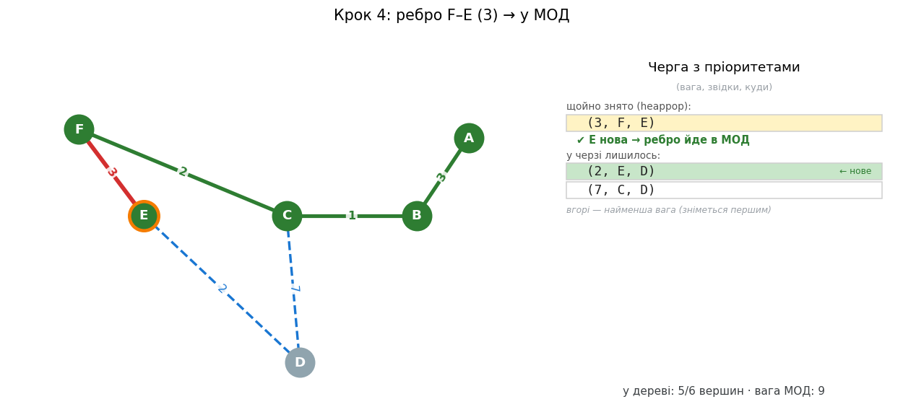

#### Крок 5: ребро `E–D (2)` — фініш

До вершини `D` ведуть два кандидати, і обидва в черзі: свіже `(2, E, D)` і давнє `(7, C, D)`. Найдешевше — `E–D (2)`: `D` приєднується, у дереві всі 6 вершин, цикл `while` завершується.

```text
============================================================
Крок 5: знято з черги ребро (2, E, D)
============================================================
D ще НЕ в дереві → приймаємо: D приєднується ребром E–D (2).
  Дерево: A, B, C, D, E, F   ·   ребер у МОД: 5/5   ·   вага: 11
  Нових ребер немає: усі сусіди D вже в дереві.
  Черга тепер: (7, C, D)
```

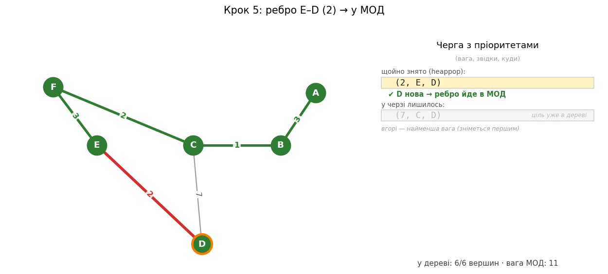

Зверніть увагу: ребро `(7, C, D)` так і **лишилося в черзі** — алгоритм завершився раніше, ніж дійшла його черга. Якби вершин було більше, його зняли б наступним кроком і пропустили як застаріле (`D` уже в дереві).

<a id="evolution"></a>

### Зведена картина: еволюція дерева

Усі стани поряд — видно, як дерево «оббігає» цикл дешевшим боком, а ребро `C–D (7)` до останнього висить кандидатом (синій пунктир), але так і не знадоблюється:

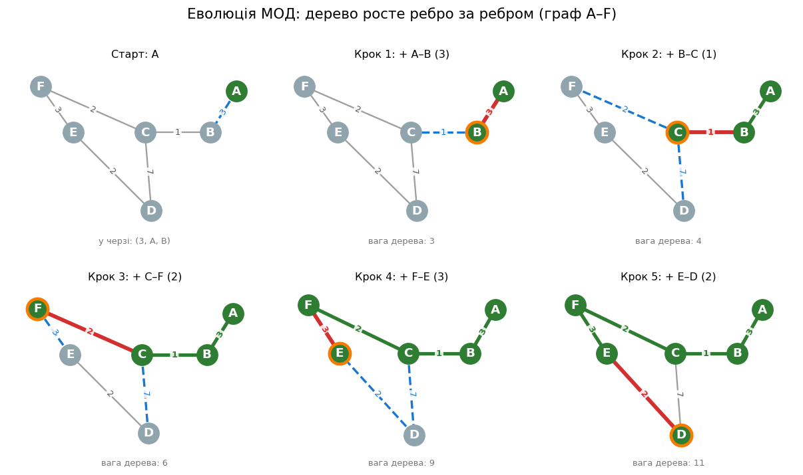

▶️ Те саме в русі — разом із чергою з пріоритетами на кожному кроці:

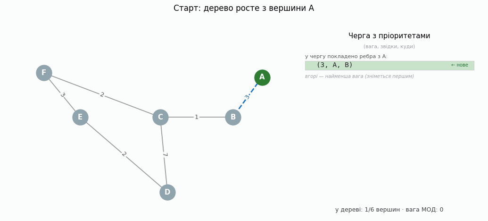

🎬 *MP4-версія:* [`evolution_abcdef.mp4`](docs/images/evolution_abcdef.mp4)

<a id="result"></a>

### Результат: МОД і відкинуте ребро

Підсумкова вага: $3 + 1 + 2 + 3 + 2 = 11$. Вивід базової реалізації:

```text
Edges in the MST:
('A', 'B', {'weight': 3})
('B', 'C', {'weight': 1})
('C', 'F', {'weight': 2})
('F', 'E', {'weight': 3})
('E', 'D', {'weight': 2})
Вага МОД: 11   (ребер: 5 із 6 можливих)
Не ввійшли до МОД: C–D (7)
```

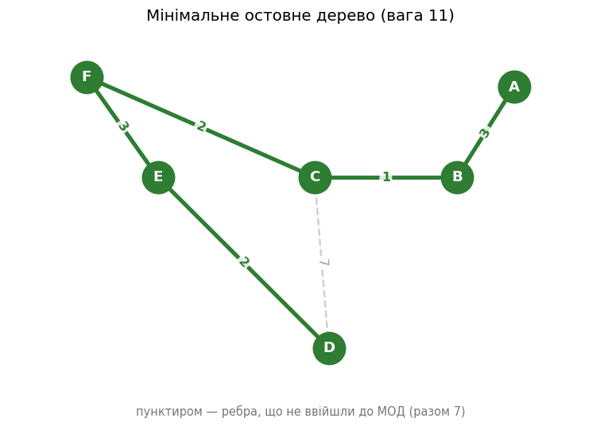

Відкинуте ребро — не випадкове. Це ілюстрація **властивості циклу** (cycle property), дзеркальної до властивості розрізу: **найважче ребро будь-якого циклу не потрібне жодному МОД** — його завжди можна замінити рештою циклу. У нашому графі цикл один (`C–D–E–F–C`), і його найважче ребро `C–D (7)` саме й випало.

Для порівняння: у розборі Флойда–Воршала на цьому ж графі (орієнтованому) найкоротший шлях `A → D` коштував `11` через `A → B → C → D`. Збіг числа `11` тут випадковий, а різниця задач принципова: МОД — **одна спільна інфраструктура** для всіх вершин, а не набір найкоротших маршрутів між парами.

---

<a id="example-2"></a>
<a id="lazy-example"></a>

## Приклад 2 — граф `A–G` з лекції: «ліниве видалення» в дії

Це граф із демонстрації базової реалізації: 7 вершин, 11 ребер — і нарешті достатньо «тісний», щоб у черзі завелися застарілі ребра.

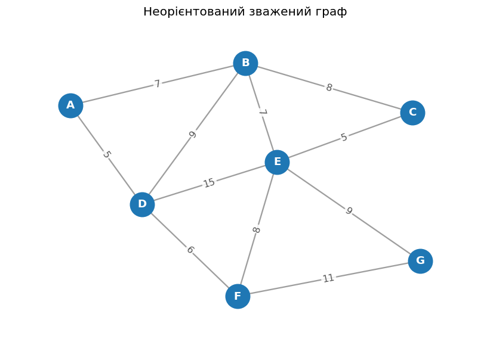

Перші п'ять кроків — звичайне зростання дерева (повний журнал друкує [`examples/02_lazy_deletion_abcdefg.py`](examples/02_lazy_deletion_abcdefg.py)):

```text
Старт:  дерево = {A};  у черзі (5, A, D), (7, A, B)
Крок 1: + A–D (5)   → у чергу (9, D, B), (15, D, E), (6, D, F)
Крок 2: + D–F (6)   → у чергу (8, F, E), (11, F, G)
Крок 3: + A–B (7)   → у чергу (8, B, C), (7, B, E)
Крок 4: + B–E (7)   → у чергу (5, E, C), (9, E, G)
Крок 5: + E–C (5)   → нових ребер немає (усі сусіди C вже в дереві)
```

Після кроку 5 у дереві шість вершин із семи (немає лише `G`), а в черзі накопичилося шість ребер — і **чотири з них уже застаріли** (обидва кінці в дереві). Далі найцікавіше: алгоритм тричі поспіль знімає застаріле ребро й пропускає його.

#### Крок 6: ребро `(8, B, C)` — застаріле

Коли це ребро потрапляло в чергу (крок 3), `C` була зовні. Але на кроці 5 вершину `C` приєднало **дешевше** ребро `E–C (5)`. Тепер `if v not in visited` дає хибу — ребро мовчки пропускається:

```text
============================================================
Крок 6: знято з черги ребро (8, B, C)
============================================================
C ВЖЕ в дереві → ребро застаріле («ліниве видалення»), пропускаємо.
  Дерево без змін: A, B, C, D, E, F   ·   вага: 30
  Черга тепер: (8, F, E), (9, D, B), (9, E, G), (11, F, G), (15, D, E)
```

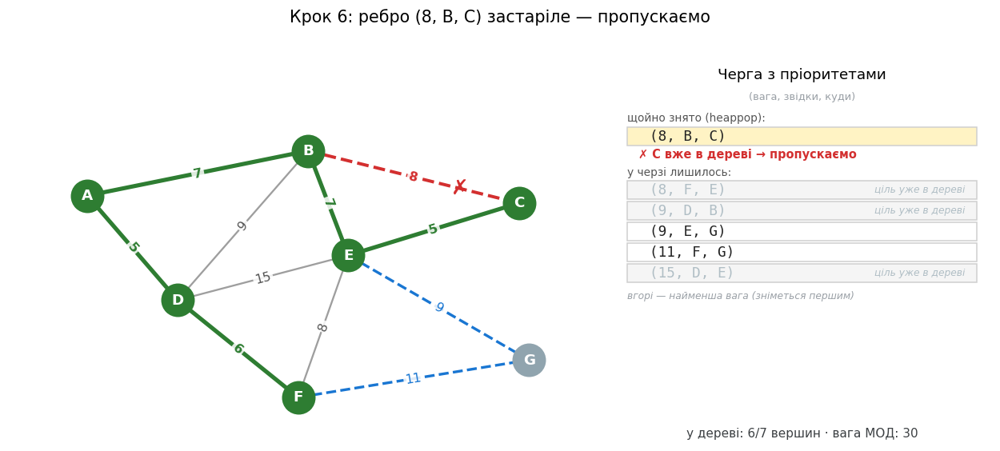

На панелі черги добре видно долю решти кандидатів: сірі рядки `(8, F, E)`, `(9, D, B)`, `(15, D, E)` — теж застарілі й чекають тієї самої долі.

#### Кроки 7–8: ще два пропуски

```text
Крок 7: (8, F, E) → E вже в дереві, пропуск
Крок 8: (9, D, B) → B вже в дереві, пропуск
```

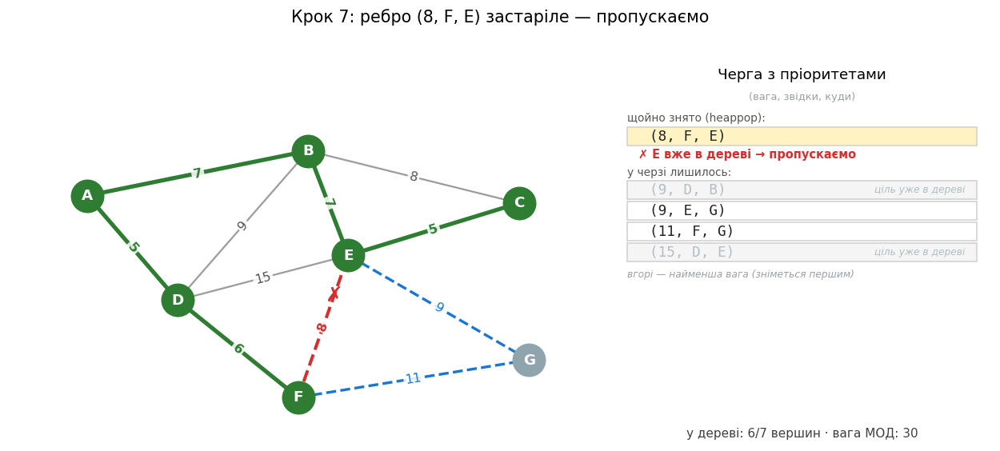

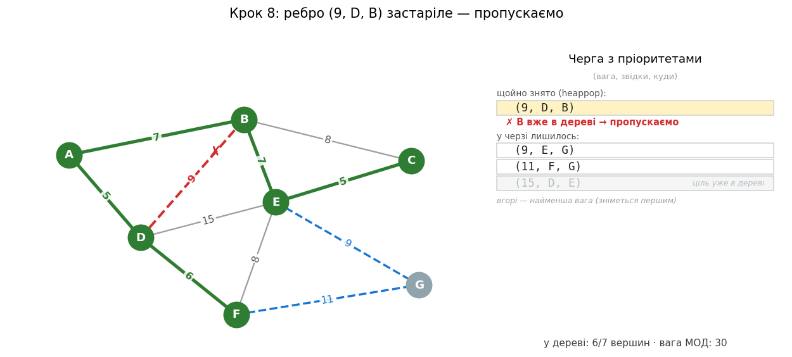

#### Крок 9: ребро `E–G (9)` — фініш

Нарешті черга віддає корисне ребро — останню вершину `G` приєднує `E–G (9)`:

```text
============================================================
Крок 9: знято з черги ребро (9, E, G)
============================================================
G ще НЕ в дереві → приймаємо: G приєднується ребром E–G (9).
  Дерево: A, B, C, D, E, F, G   ·   ребер у МОД: 6/6   ·   вага: 39
  Нових ребер немає: усі сусіди G вже в дереві.
  Черга тепер: (11, F, G), (15, D, E)
```

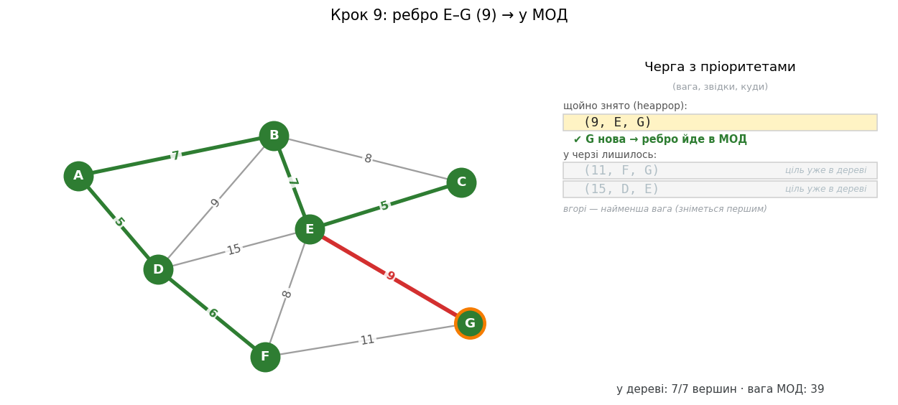

Підсумок (порівняйте з виводом базової реалізації з лекції — він той самий):

```text
Edges in the MST:
('A', 'D', {'weight': 5})
('A', 'B', {'weight': 7})
('D', 'F', {'weight': 6})
('B', 'E', {'weight': 7})
('E', 'C', {'weight': 5})
('E', 'G', {'weight': 9})
Вага МОД: 39   (ребер: 6 із 11 можливих)
Не ввійшли до МОД: B–C (8), B–D (9), D–E (15), E–F (8), F–G (11)
```

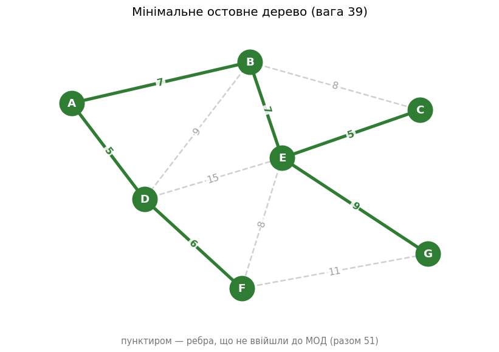

Уся еволюція разом — пропуски підписані ✗:

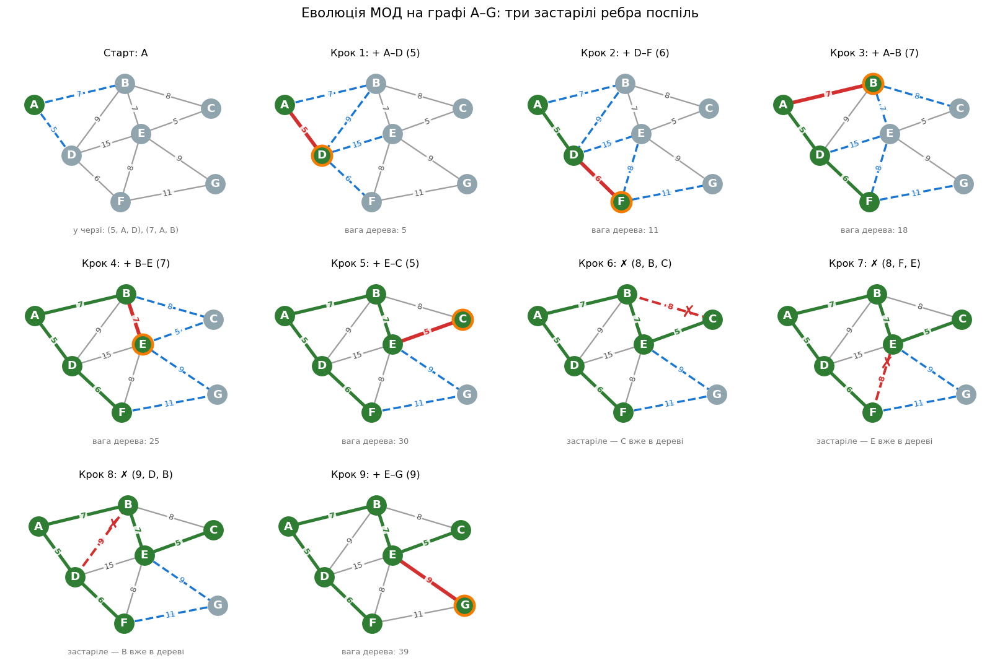

▶️ Анімована версія з чергою на кожному кроці:

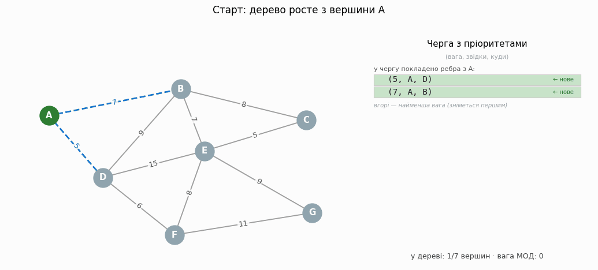

🎬 *MP4-версія:* [`evolution_abcdefg.mp4`](docs/images/evolution_abcdefg.mp4)

**Мораль прикладу.** Ліниве видалення — це компроміс: черга тримає до $O(E)$ елементів і інколи віддає сміття, зате кожна операція — простий `heappush`/`heappop` без жодних додаткових структур. Альтернатива без сміття — [eager-версія](#eager) нижче.

---

<a id="disconnected"></a>

## Обмеження: незв'язний граф

Остовне дерево **існує лише у зв'язного графа**: якщо граф розпадається на «острови», жоден набір ребер їх не з'єднає. Що станеться, якщо все одно запустити Прима?

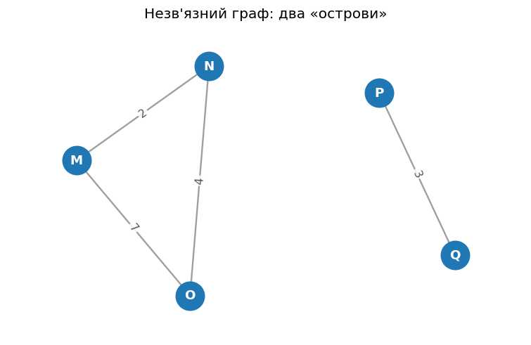

```text
Чи зв'язний граф? nx.is_connected → False
Компоненти зв'язності: {M, N, O}; {P, Q}

Запускаємо базову реалізацію prim_mst на незв'язному графі…
  💥 IndexError: heappop із порожньої черги.
  Дерево охопило компоненту старту, а вершини P, Q недосяжні —
  умова `visited != set(graph.nodes())` ніколи не стане хибною.
```

Механіка провалу: дерево швидко вбирає всю компоненту старту (`M, N, O`), нових ребер у чергу більше не надходить, черга порожніє — а цикл `while visited != set(graph.nodes())` усе ще чекає на `P` і `Q`. Наступний `heappop` падає з `IndexError`.

> **Підступніший варіант.** [Eager-версія](#eager) у цій ситуації не падає, а **мовчки** повертає дерево однієї компоненти — результат виглядає правдоподібно, але остовним деревом не є. Помилка, що кричить, краща за помилку, що мовчить: перевіряйте зв'язність на вході.

Чесні виходи:

1. **Перевірити заздалегідь:** `nx.is_connected(graph)` — і повідомити про помилку явно.
2. **Будувати мінімальний остовний ліс** (minimum spanning forest): окреме МОД у кожній компоненті. Це робить [`prim_msf`](prim_mst/core.py) — Прим запускається в кожній компоненті окремо:

```text
Мінімальний остовний ліс (prim_msf): 3 ребра, вага 9.
```

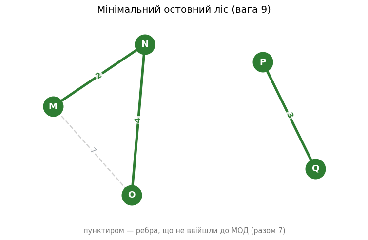

У компоненті `{M, N, O}` відкинуто найважче ребро її циклу (`M–O (7)` — знову властивість циклу), а «острів» `{P, Q}` отримав своє єдине ребро.

---

<a id="code-walkthrough"></a>

## Покрокове виконання коду: панелі «код ↔ граф ↔ черга»

Приклади вище показували *результат* кожного кроку. Тут — **сам код у дії**: ліворуч фрагмент алгоритму з **підсвіченими активними рядками**, по центру — граф, праворуч — черга з пріоритетами саме в цей момент. **Колір рядка коду кодує, яка гілка спрацювала:** 🟨 рядок виконується зараз, 🟩 умова `if v not in visited` істинна → ребро прийнято, 🟥 вершина вже в дереві → ребро пропущено.

Обидва артефакти будуються з одного журналу знімків ([`prim_mst/walkthrough.py`](prim_mst/walkthrough.py)); генерує їх приклад [`examples/05_code_walkthrough.py`](examples/05_code_walkthrough.py).

### Граф `A–F`: по одному рядку на кожне зняте ребро

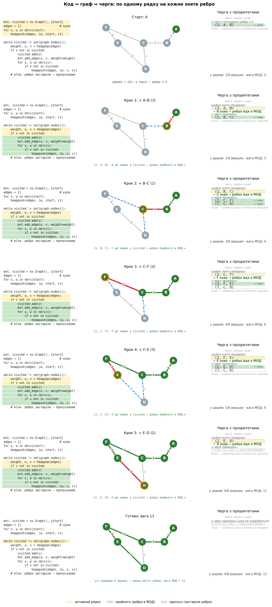

▶️ Анімована версія — між «розв'язками» вставлено кадри «`heappop`: перевіряємо вершину» (жовтий рядок у черзі — те, що зараз зніметься):

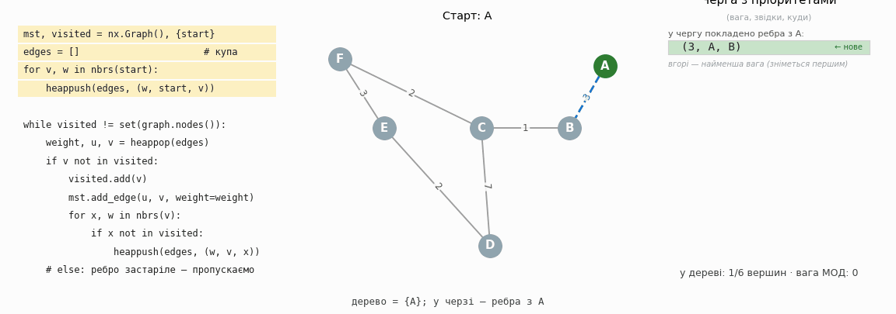

🎬 *MP4-версія:* [`code_walk_abcdef.mp4`](docs/images/code_walk_abcdef.mp4)

### Граф `A–G`: видно обидві гілки `if`

На кроках 6–8 спрацьовує **червона** гілка (ребро застаріле — пропуск) — у статичній сітці ці рядки одразу впадають в око:

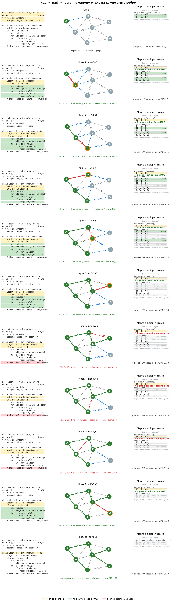

▶️ Анімація:

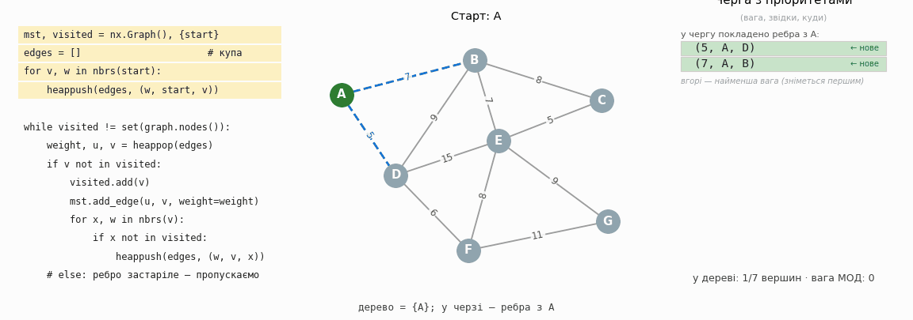

🎬 *MP4-версія:* [`code_walk_abcdefg.mp4`](docs/images/code_walk_abcdefg.mp4)

---

<a id="complexity"></a>

## Складність і порівняння

**Базова (лінива) версія:** кожне ребро може потрапити в чергу щонайбільше двічі (по разу з кожного кінця), тож черга має до $O(E)$ елементів, а кожна операція коштує $O(\log E)$. Разом — $O(E \log E)$ часу та $O(E)$ пам'яті на чергу. Оскільки $E \le V^2$, маємо $\log E \le 2 \log V$ — тобто це те саме, що $O(E \log V)$, з точністю до константи.

**Eager-версія** (двійкова купа + decrease-key або словник «найкраще ребро до вершини»): у черзі щонайбільше $V$ елементів — $O(E \log V)$ часу та $O(V)$ пам'яті. З купою Фібоначчі — теоретично $O(E + V \log V)$ (на практиці рідко варте складності реалізації).

| Алгоритм | Складність | Стратегія | Коли краще |
|---|---|---|---|
| **Прим (лінивий, купа)** | $O(E \log E)$ | дерево росте з вершини | простий код, щільні графи |
| Прим (eager, купа) | $O(E \log V)$ | те саме + decrease-key | коли пам'ять на чергу критична |
| Краскал | $O(E \log E)$ | сортуємо ребра, зшиваємо ліс (DSU) | розріджені графи, ребра вже відсортовані |
| Борувка | $O(E \log V)$ | усі компоненти ростуть паралельно | паралельні/розподілені обчислення |

Прим і Краскал дають **ту саму вагу** МОД (а за різних ваг ребер — і те саме дерево), різниця лише в порядку, в якому ребра приймаються: Прим веде **одне** дерево від стартової вершини, Краскал тримає **ліс** і на кожному кроці бере глобально найдешевше ребро, що не створює циклу.

**Чи залежить результат від стартової вершини?** Вага — ніколи. Саме дерево — теж ні, якщо всі ваги різні (МОД тоді єдине). За однакових ваг можливі різні, але однаково мінімальні дерева; у наших прикладах усі МОД єдині, тож старт можна обирати будь-який.

<a id="applications"></a>

## Де це застосовується

Те саме «найдешевше з'єднати все» виринає в дуже різних задачах:

- **Проєктування мереж.** Електромережі, оптоволокно, трубопроводи, розводка плат: вузли треба з'єднати в одну мережу мінімальної вартості. Історично з цього алгоритм і народився (Отакар Борувка електрифікував Моравію у 1926-му; Прим перевідкрив свій алгоритм у Bell Labs для телефонних мереж).
- **Кластеризація.** Побудуйте МОД на точках даних і приберіть $k-1$ найважчих ребер — отримаєте $k$ кластерів (це single-linkage clustering у термінах МОД).
- **Наближення для задачі комівояжера.** Для метричної TSP обхід МОД дає маршрут, не більш ніж **удвічі** довший за оптимальний, — класична 2-апроксимація.
- **Генерація лабіринтів.** Прим на ґратці з випадковими вагами дає ідеальний лабіринт: між будь-якими двома клітинами рівно один шлях (бо остовне дерево — без циклів).
- **Сегментація зображень.** Пікселі — вершини, схожість сусідів — ваги: МОД-підхід лежить в основі графових методів сегментації (наприклад, алгоритму Фельзенцвальба–Гуттенлохера).

Спільна риса: потрібна **одна спільна структура-з'єднання** мінімальної сумарної ваги, а не найкоротші маршрути між парами.

<a id="eager"></a>

## Бонус: eager-версія (черга без дублікатів)

Ліниву чергу можна «привчити до порядку»: замість усіх ребер тримати для кожної вершини поза деревом лише **найкраще відоме** ребро до дерева. Знайшли дешевше — оновили запис (семантика *decrease-key*). Тоді в черзі ніколи не буває ні дублікатів, ні застарілих ребер, а пам'ять — $O(V)$ замість $O(E)$. Реалізація зі словником (див. [`prim_mst_eager`](prim_mst/core.py)):

```python
def prim_mst_eager(graph, start):
    mst = nx.Graph()
    visited = {start}
    # best[v] = (вага, u): найдешевше відоме ребро, що з'єднує v із деревом
    best = {v: (w, start) for _, v, w in graph.edges(data='weight', nbunch=[start])}

    while best:
        v = min(best, key=lambda x: (best[x][0], str(x)))   # найдешевший кандидат
        weight, u = best.pop(v)
        visited.add(v)
        mst.add_edge(u, v, weight=weight)
        for _, x, w in graph.edges(data='weight', nbunch=[v]):
            if x not in visited and (x not in best or w < best[x][0]):
                best[x] = (w, v)        # decrease-key: знайшли дешевше ребро до x

    return mst
```

Ця версія з `min` по словнику — $O(V^2 + E)$: для **щільних** графів ($E \approx V^2$) це навіть оптимально й швидше за будь-яку купу. Для розріджених — замініть словник на купу з decrease-key і отримаєте $O(E \log V)$. На обох навчальних графах eager-версія будує ті самі дерева, що й лінива (це перевіряють [тести](tests/test_core.py)).

<a id="summary"></a>

## Підсумок

- **МОД** — найдешевший набір ребер, що з'єднує всі вершини без циклів; у дереві на $n$ вершинах рівно $n-1$ ребро.
- **Прим — жадібний:** дерево росте з однієї вершини, щокроку приєднуючи найдешевше ребро через розріз «дерево ↔ решта».
- Жадібність тут **доведено безпечна** — властивість розрізу (а відкинуті ребра пояснює дзеркальна властивість циклу: найважче ребро циклу не потрібне ніколи).
- Робоча конячка — **черга з пріоритетами** `(вага, звідки, куди)`; застарілі ребра відсіює **ліниве видалення** — один рядок `if v not in visited`.
- На графі `A–F` (тому самому, що у Флойда–Воршала) МОД має вагу **11**, відкинуто найважче ребро єдиного циклу — `C–D (7)`; на графі `A–G` з лекції — вагу **39** і три пропуски застарілих ребер поспіль.
- Прим вимагає **зв'язного** графа: інакше базова реалізація падає (`IndexError`), а чесна відповідь — мінімальний остовний **ліс** (`prim_msf`).
- Складність базової версії $O(E \log E)$; eager-версія тримає чергу $O(V)$ без дублікатів.

---

<a id="license"></a>

## Ліцензія

[MIT](LICENSE) © 2026 Maryna Shavlak
